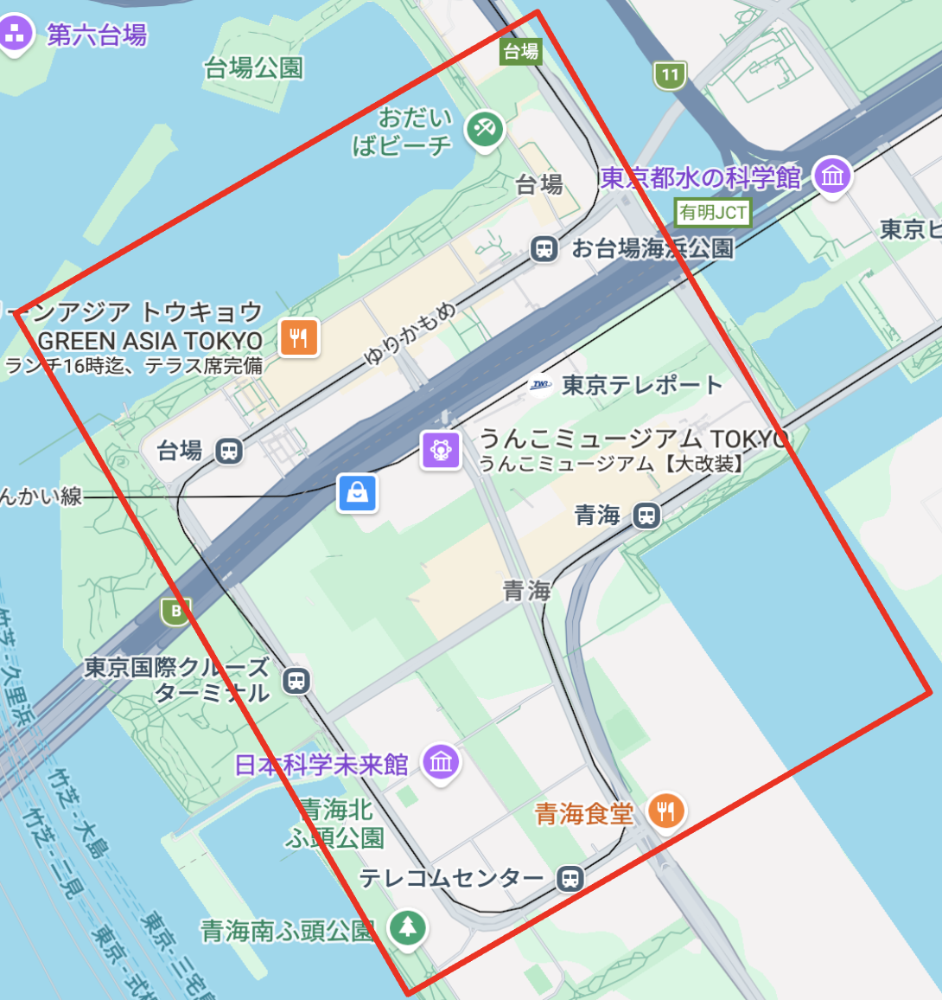

Turing Safety Claim | 初版ドラフト

**Turing Safety Claim**

E2E AIと多重系ADSを中核とするL4自動運転車両の安全論証

| **版** | 第2版ドラフト（章立て第2版・本文第0〜6章および第14章を第2版相当に書き換え済） |
| --- | --- |
| **作成日** | 2026年4月29日（初版）／ 2026年5月1日（第2版章立て・第0〜6章・第14章反映） |
| **位置づけ** | 最上位安全論証ハブ。詳細仕様は衛星文書群に切り出し、本書は主張・設計思想・参照ポインタを保持する |

# 第2版改訂の状態

本書は第2版への移行途上にある。本改訂時点の状態は以下である。

| 要素 | 状態 |
| --- | --- |
| 目次（章立て） | **第2版構成（22章＋Appendix A〜I）に置換済** |
| 第0章 要約 | **第2版相当に書き換え済**（異種ECU冗長・7+1カメラ・衛星文書群・PRBを反映） |
| 第1章 本書の位置づけ | **第2版相当に書き換え済**（目的を9項目化・ISO非準拠原則と対応の四区分を追記） |
| 第2章 対象システムの概要 | **第2版相当に書き換え済**（通常走行用ECU＋MRC用ECUの異種ECU冗長を明記） |
| 第3章 用語と前提条件 | **第2版相当に書き換え済**（3.18特定自動運行主任者、3.19 DSSAD、3.20 Triggering Condition、3.21 Cascading Failure / Latent Fault、3.22 Positive Risk Balanceを追加） |
| 第4章 最上位安全主張 | **第2版相当に書き換え済**（4.3主要Hazard・ASIL・Safety Goalの要約を新設、サブゴール(b)にPositive Risk Balanceの根拠を追記、4.4基本前提を10項目に拡充） |
| 第5章 安全論証の全体構造 | **第2版相当に書き換え済**（5.2領域マップを新章を含む全体図に再構成、5.3にAI Safety Requirements導出参照を追記、5.4に車両アーキテクチャの論証枠組み表を追加） |
| 第6章 ISO規格と国際規制の適用方針 | **第2版相当に書き換え済**（SOTIFは概念借用のみ・ISO 21448準拠は目的としない） |
| 第7〜13章、第15〜16章 旧本文 | **初版本文を残置**（後続改訂で順次第2版化） |
| 第14章 サイバーセキュリティ方針 | **第2版相当に新規執筆済・本書本文に統合済**（別ドラフト `06_Chapter14_Cybersecurity_draft.md` も参照） |
| 第15章（法令・制度対応）、第16章（型式指定スキーム）、第18章（事故対応）、第19章（段階的社会実装） | **未着手**（後続改訂で新規執筆） |
| 第20章 安全論証を支える証拠の位置づけ | **初版第14章を第20章として残置**（後続改訂で第2版相当に書き換え） |
| Appendix A〜D | 初版を残置 |
| Appendix E（ISO・規制対応マップ詳細版） | 別ドラフト `04_Appendix_E_ISO_Mapping_detailed.md` を参照（第2版本文に統合予定） |
| Appendix F〜I | 後続改訂で整備 |
| 衛星文書骨子 | `02_VMC_IF_Specification_draft.md`、`03_Vehicle_Requirements_Specification_draft.md`、`05_Chapter9_HeterogeneousSoC_draft.md`、`06_Chapter14_Cybersecurity_draft.md` を参照 |

そのため、本書を読む際は、第2版章立てと第0〜6章・第14章本文を「方向性の確定版」、その他の本文を「初版のまま参照する補助資料」と扱われたい。

# 目次（第2版章立て）

0. 要約

0.1 本書の目的

0.2 TuringのL4安全主張

0.3 本書で扱う範囲

0.4 本書で確定しない範囲

1. 本書の位置づけ

1.1 背景

1.2 本書の目的（第2版で9項目化）

1.3 本書の性格（ISO非準拠原則と対応の四区分）

2. 対象システムの概要

2.1 対象とするL4自動運転システム

2.2 システム構成の基本思想（異種ECU冗長を明記）

2.3 E2E AIの位置づけ

2.4 多重系ADSの位置づけ（通常走行用ECU＋MRC用ECUの異種ECU冗長）

2.5 遠隔監視の位置づけ

3. 用語と前提条件

3.1 L4

3.2 ADS

3.3 E2E AI

3.4 ODD

3.5 通常走行モード

3.6 MRCモード

3.7 MRM / MRC

3.8 通常走行ADS

3.9 MRC系ADS

3.10 安全監視系

3.11 フェイルオーバー

3.12 ハードウェア失陥

3.13 カメラ健全性

3.14 DSSAD相当ログ

3.15 通常走行用ECU

3.16 MRC用ECU

3.17 MRC専用カメラ

3.18 特定自動運行主任者（第2版で追加）

3.19 DSSAD（UN-R 157）（第2版で追加）

3.20 Triggering Condition（SOTIF概念の借用語彙）（第2版で追加）

3.21 Cascading Failure / Latent Fault（ISO 26262）（第2版で追加）

3.22 Positive Risk Balance（第2版で追加）

4. 最上位安全主張

4.1 最上位安全主張

4.2 許容しきい値の定義方針

4.3 主要Hazard・ASIL・Safety Goalの要約（第2版で追加。詳細は別文書HARA）

4.4 安全主張を支える基本前提

4.5 サブゴール(a) 通常走行リスクが許容範囲内であること

4.6 サブゴール(b) 失陥時のMRC成立性（Positive Risk Balanceを根拠とする旨を追記）

4.7 安全主張の信頼性維持

4.8 遠隔監視に関する補足主張

5. 安全論証の全体構造

5.1 安全論証を分けて考える理由

5.2 安全論証の領域（新章を含めた全体図に改訂）

5.3 AIで扱うリスク（AI Safety Requirements導出への参照）

5.4 車両アーキテクチャで扱うリスク

6. ISO規格と国際規制の適用方針 ★第2版本文に書き換え済★

6.1 ISO規格を用いる目的（抜け漏れチェック・共通言語、対応の四区分）

6.2 ISO/TS 5083の使い方

6.3 ISO 26262の使い方（Cascading Failure・Latent Fault・診断カバレッジを追記）

6.4 ISO 21448 / SOTIFの扱い（概念借用・準拠は目的としない）

6.5 ISO/PAS 8800の使い方（全面増補）

6.6 ISO 34502系の使い方

6.7 ISO 24089の使い方（rolling update中の系間バージョン差異を追記）

6.8 ISO/SAE 21434の扱い

6.9 UL 4600の参照（第2版で新設）

6.10 UN-R 157のDSSAD要件との対応（第2版で新設）

6.11 ISO・規制対応マップ（詳細はAppendix Eおよび別ドラフトを参照）

7. ODDの定義と扱い（お台場具体記述は別文書「お台場ODD定義書」へ切り出し）

7.1 ODDを定義する目的

7.2 ODDに含める条件

7.2.1 初期運用ジオフェンス（お台場・青海エリア）（概要のみ。詳細はODD定義書）

7.3 ODD内通常走行

7.4 ODD境界（代表的な機能限界トリガー条件の例を反映）

7.5 ODD逸脱時の基本挙動

8. E2E AIによる通常走行安全

8.1 E2E AIの基本思想

8.2 入力と出力

8.3 認識・予測・判断・制御の扱い

8.4 通常走行安全を車両挙動として説明する考え方

8.5 E2E AIに求める安全側挙動（7カテゴリ整理。場面カタログはAI Safety Caseへ）

8.6 E2E AI出力に対する安全監視

8.7 E2E AIの限界とMRC遷移

8.8 AI Safety Requirementsの導出（第2版で新設。詳細はAI Safety Case）

9. 多重系ADSによる失陥時安全（**異種ECU冗長を中核に大幅改訂**）

9.1 多重系ADSを採用する目的

9.2 通常走行ADSの役割

9.3 MRC系ADSの役割（MRC専用カメラ1台で同一車線内安全停止に書き換え）

9.4 異種ECU冗長アーキテクチャ（第2版で新設）

9.5 安全監視系の役割

9.6 一系統失陥時の自動フェイルオーバー

9.7 フェイルオーバー後のMRCモード遷移

9.8 通常走行への自動復帰禁止

9.9 両系統異常時の扱い

9.10 共通原因故障の考え方（全面拡充：Cascading Failure・Latent Fault含む）

9.11 MRC系ADS実装方針（異種ECU構成を採用方針として確定）

10. センサ・計算機・車両制御系の失陥安全（3層縮退構造に再構成）

10.1 ハードウェア失陥をE2E AIで吸収しない理由

10.2 カメラ構成と独立性（通常走行用7台 + MRC専用1台）

10.3 通常走行用カメラ群の縮退能力

10.4 MRC専用カメラ失陥時の基本挙動

10.5 カメラ健全性の考え方

10.6 ECU失陥時の基本挙動（異種ECU冗長を反映）

10.7 制動系失陥時の基本挙動（定量要求は車両要求仕様書へ）

10.8 操舵系失陥時の基本挙動（定量要求は車両要求仕様書へ）

10.9 電源失陥時の基本挙動（定量要求は車両要求仕様書へ）

10.10 通信・時刻同期失陥時の基本挙動（定量要求は車両要求仕様書／VMC I/F仕様書へ）

11. MRC設計の基本思想

11.1 MRCの目的（MRC専用カメラ1台での同一車線内安全停止を中核として明示）

11.2 MRC開始条件の考え方

11.3 MRCモードで制限する行動

11.4 現在車線内停止の考え方（全面書き換え。停止より走行継続が安全な場面の識別、MRC位置選定アルゴリズムの考え方）

11.5 交差点・横断歩道付近での考え方（増補）

11.6 ハザード・外向けHMI

11.7 停止後の状態保持

11.8 MRC失敗時の考え方

12. 遠隔監視と運用安全

12.1 遠隔監視の位置づけ（特定自動運行主任者との関係を追記）

12.2 遠隔監視をMRC成立根拠にしない理由

12.3 MRC後の遠隔監視の役割

12.4 遠隔監視断時の扱い

12.5 特定自動運行制度との接続（第2版で新設。詳細は特定自動運行計画書）

13. ログ・記録保全

13.1 ログを安全論証に含める理由

13.2 記録すべき主な情報（UN-R 157 DSSAD要件と対応付けた表に再構成）

13.3 事後再現性の考え方

13.4 事故時のデータ提出プロセス（第2版で新設）

14. サイバーセキュリティ方針 — **新章**

14.1 Cybersecurity Caseの位置付け

14.2 主要攻撃面と対策の概要

14.3 Safety/Security Co-Engineering

14.4 OEM-Turing分担

14.5 UN-R 155準拠とCybersecurity Caseへの参照

15. 法令・制度対応 — **新章**

15.1 対象とする法令・規則

15.2 保安基準への対応方針

15.3 特定自動運行許可との関係

15.4 UN規則との関係

15.5 国際整合性

16. 型式指定スキームと責任構造 — **新章**

16.1 Turingが採用する型式指定スキーム

16.2 車両構造起因とADS起因の責任分界

16.3 事故時の原因究明・リコール責任・賠償責任の構造

16.4 国交省・NALTECとの協議事項

16.5 国際整合性と海外展開時の扱い

17. 責任分界（技術）

17.1 責任分界を明確にする理由

17.2 Turingが主に担う範囲

17.3 車両側に求める範囲

17.4 運用側に求める範囲

17.5 共同で成立させる範囲（増補。詳細はAppendix I責任分界マトリクス）

18. 事故・インシデント対応プロセス — **新章**

18.1 インシデントの分類

18.2 現場対応プロセス

18.3 当局・調査機関への協力

18.4 メディア・社会への説明

18.5 業界全体への情報共有

19. 段階的社会実装ロードマップ — **新章**

19.1 Phase 1：実証フェーズ（0〜18ヶ月）

19.2 Phase 2：限定商用フェーズ（18〜36ヶ月）

19.3 Phase 3：本格商用フェーズ（36ヶ月〜）

19.4 各フェーズの移行判断基準

19.5 業界全体への波及効果

20. 安全論証を支える証拠の位置づけ

20.1 本書における証拠の扱い

20.2 後続証拠の分類

20.3 後続文書で具体化する項目（衛星文書群一覧として再整理）

21. 残存リスクと今後の更新

21.1 残存リスクの考え方（Positive Risk Balance、人間ドライバ比較、累積運行時間に対する期待事故率を追加）

21.2 E2E AIに関する残存リスク

21.3 多重系ADSに関する残存リスク

21.4 MRCに関する残存リスク

21.5 運用に関する残存リスク

21.6 安全論証の更新方針（Phase 1〜3の各段階での更新方針）

22. 結論

22.1 TuringのL4安全論証の要点

22.2 最終主張（業界全体への貢献姿勢を追加）

Appendix A. システム構成図（異種ECU冗長＋7+1カメラ構成を反映）

Appendix B. 多重系ADS構成図（異種ECU構成と7+1カメラを明示）

Appendix C. 状態遷移図

Appendix D. MRC状態遷移図

Appendix E. ISO・規制対応マップ（詳細版）（章・要求項目単位、四区分、UN-R 157 DSSAD含む。詳細は別ドラフト `04_Appendix_E_ISO_Mapping_detailed.md` を参照。SOTIF項目はOption B方針により観点参照扱い）

Appendix F. 用語集と用語マッピング表（Turing独自用語 ↔ ISO 26262/UN-R用語の対応表）

Appendix G. 後続証拠文書一覧と文書体系マップ

Appendix H. 法令対応マップ — **新設**（道運車法／保安基準／道交法／特定自動運行／UN規則と本書章の対応）

Appendix I. 責任分界マトリクス — **新設**（保安基準項目別、OEM主管／Turing主管／共同）

Appendix J. 初期運用ジオフェンス地図（旧Appendix H）

参考文献・参照規格

# 0. 要約

## 0.1 本書の目的

本書は、Turingが開発するL4自動運転車両について、安全性をどのような考え方で成立させ、どのような構造で説明するかを整理する安全論証文書である。

本書では、L4自動運転車両の安全性を、単一の性能指標や単一の試験結果で説明しない。Turingの安全論証では、通常走行時のE2E AIによる安全性と、失陥時の多重系ADSによるMRC達成性を分けて整理する。

TuringのL4自動運転車両は、通常走行時には、複数のカメラ画像（通常走行用カメラ群7台）を主入力とし、舵角指示および加速度指示を出力するE2E AIを中核として走行する。一方で、ADS、センサ、計算機、通信、電源、制動、操舵等に失陥が生じた場合には、通常走行を無理に継続するのではなく、**通常走行用ECUとMRC用ECUからなる異種ECU冗長**による多重系ADS、安全監視系、MRC専用カメラ1台、車両制御I/FによりMRCモードへ遷移し、車両単独でリスク最小状態に到達することを目指す。

本書（第2版）は、TuringのL4安全論証として、安全主張、システム前提、E2E AIの位置づけ、多重系ADSの位置づけ（異種ECU冗長を中核とする）、MRCの基本思想（MRC専用カメラ1台での同一車線内安全停止）、遠隔監視の位置づけ（特定自動運行制度との接続を含む）、ログ・記録保全（UN-R 157 DSSAD要件との対応）、ISO規格・UN規則・国内法令の使い方（対応の四区分）、サイバーセキュリティ・法令制度・型式指定との接続、段階的社会実装（Phase 1〜3）、残存リスクの考え方を示す。

具体的な試験条件、合格基準、検証手順、定量的な受入基準、FMEA/FTA等の詳細は、本書では確定しない。これらは、本書を最上位とする衛星文書群（AI Safety Case、ODD定義書、HARA、車両要求仕様書、VMC I/F仕様書、Cybersecurity Case、モデル更新管理書、ログ項目定義書、運用文書群、特定自動運行計画書等）で具体化する。

## 0.2 TuringのL4安全主張

TuringのL4安全論証における最上位安全主張は、以下である。

*TuringのL4自動運転車両は、定義されたODD内において、車両起因の重大事故および重大インシデントの発生率が、別途定める許容しきい値を下回ることを主張する。本主張は、(a) 通常走行リスクが許容範囲内であること、(b) 失陥時にMRCが成立しリスク最小状態に到達すること、の2つのサブゴールにより支える。サブゴール(a)(b)の信頼性は、運用後監視、更新管理、共通原因故障（CCF）・Cascading Failure・Latent Faultの継続評価等の支援的論証により維持する。*

許容しきい値そのものの数値は本書では確定せず、しきい値の定義方針のみを示す。定義方針は、同一ODDにおける人間運転者の事故率等を比較ベンチマークとする**Positive Risk Balance（PRB）型**を基本とする。具体的な数値、合格基準、検証手順は後続の証拠文書で具体化する。

サブゴール(a)(b)を成立させる基本方針は、次のとおりである。

| **領域** | **基本方針** |
| --- | --- |
| 通常走行安全 | 通常走行用カメラ群7台を入力とし舵角・加速度を出力するE2E AIの閉ループ車両挙動として論証する |
| 失陥時安全 | E2E AIの通常機能で故障を吸収せず、通常走行用ECUとMRC用ECUの異種ECU冗長による多重系ADS、安全監視、MRCで扱う |
| MRC | 故障時の目的を通常走行継続ではなく、MRC専用カメラ1台を用いた同一車線内の安全停止とする |
| 遠隔監視 | MRC成立の一次安全手段ではなく、停止後の状態確認・乗客対応・回収等に用いる（特定自動運行主任者制度との接続を含む） |
| 記録保全 | E2E AI出力、失陥検知、フェイルオーバー、MRC遷移、車両状態をUN-R 157 DSSAD要件と整合する形で再現可能に記録する |
| 信頼性維持 | 運用後監視、更新管理、CCF・Cascading Failure・Latent Faultの継続評価により安全主張を補強する |

主要HazardおよびSafety Goalの分解、許容しきい値の数値定義は、衛星文書HARAおよび後続の証拠文書で具体化する。

## 0.3 本書で扱う範囲

本書（第2版）では、以下を扱う。

TuringのL4安全論証の基本方針

対象システムの概要（異種ECU冗長を含む）

用語と前提条件

最上位安全主張（PRBを根拠とするサブゴール構造）

安全論証の全体構造

ISO規格・UN規則・国内法令の適用方針（対応の四区分）

ODDの定義と扱い（初期運用ジオフェンス概要を含む。詳細はODD定義書）

E2E AIによる通常走行安全（AI Safety Requirementsの導出方針）

多重系ADSによる失陥時安全（異種ECU冗長アーキテクチャ）

センサ（通常走行用7台 + MRC専用1台）、計算機、車両制御系の失陥安全

MRC設計の基本思想（MRC専用カメラ1台での同一車線内安全停止）

遠隔監視と運用安全（特定自動運行制度との接続）

ログ・記録保全（UN-R 157 DSSAD要件との対応）

サイバーセキュリティ方針（Cybersecurity Caseとの接続）

法令・制度対応および型式指定スキームと責任構造

責任分界（技術）

事故・インシデント対応プロセス

段階的社会実装ロードマップ（Phase 1〜3）

残存リスクと安全論証の継続更新方針

## 0.4 本書で確定しない範囲

本書では、以下を確定しない。

許容しきい値そのものの数値

具体的な試験条件

試験手順

合格基準

検証回数

シナリオ網羅率

定量的な停止距離基準

フェイルオーバー時間要求の数値

FMEA/FTA/STPAの詳細表

OEMまたは車両側への詳細要求仕様の数値

運用マニュアル

市場投入後の詳細な安全管理手順

これらは、本書を最上位とする以下の衛星文書群で具体化する：AI Safety Case、ODD定義書、HARA、車両要求仕様書、VMC I/F仕様書、Cybersecurity Case、モデル更新管理書、ログ項目定義書、運用文書群、特定自動運行計画書、検証文書群等。衛星文書群の全体構成はAppendix Gで整理する。

# 1. 本書の位置づけ

## 1.1 背景

L4自動運転車両では、定義された走行環境条件、すなわちODD内において、運転者が運転操作を引き継ぐことを前提にしない。そのため、通常走行時の性能だけでなく、故障、機能低下、ODD逸脱、通信断、遠隔監視断などの状況においても、車両自身がリスクを下げる必要がある。

TuringのL4自動運転システムは、通常走行の中核として、カメラ画像から舵角指示および加速度指示を出力するE2E AIを用いる。この構成は、従来型の自動運転システムで分離されていた認識、予測、判断、制御を個別のソフトウェアモジュールとして実装するモジュール構造ではない。認識、予測、判断、制御は、単一のAIモデルの内部機能として統合され、最終的には車両操作指示として現れる。

一方で、E2E AIを通常走行の中核に用いることは、故障時の安全停止までAI任せにすることを意味しない。カメラ、SoC、ECU、通信、電源、制動、操舵などの失陥は、E2E AIの通常機能で吸収するのではなく、**通常走行用ECUとMRC用ECUからなる異種ECU冗長**による多重系ADS、安全監視、縮退制御、MRCによって扱う。これにより、シリコン・ファームウェア・OS・AIモデル・systematic failure・センサ入力レベルの共通原因故障（CCF）を設計上排除する。

本書は、このTuringの安全設計思想を、安全論証として一貫した形で示すものである。

## 1.2 本書の目的

本書の目的は、TuringのL4自動運転車両について、以下を明確にすることである（第2版で9項目化）。

1. 何を安全と主張するのか

2. その主張をどのようなシステム構成で支えるのか（通常走行用ECU＋MRC用ECUの異種ECU冗長を含む）

3. E2E AIをどの範囲で安全論証するのか

4. ハードウェア失陥をどのように扱うのか

5. 一系統失陥時にMRC系ADSがどのようにMRCへ移行するのか

6. 遠隔監視をどのように位置づけるのか（特定自動運行制度との接続を含む）

7. ISO規格・UN規則・国内法令をどの目的で参照するのか（対応の四区分）

8. サイバーセキュリティおよび責任分界（技術・型式指定）をどのように構成するか

9. 今後どの衛星文書および段階的社会実装（Phase 1〜3）で詳細化していくか

## 1.3 本書の性格

本書は、TuringのL4安全論証の第2版である。

本書は、試験計画書、FMEA詳細書、システム要求仕様書、運用マニュアル、サイバーセキュリティケースを置き換えるものではない。本書は、それらの後続文書および衛星文書が何を支えるべきかを定義する最上位文書である。

本書では、まず安全主張、設計思想、責任分界、残存リスクの扱いを定義する。そのうえで、具体的な検証、試験、解析、ログ、運用手順については、後続の証拠文書で具体化する。

### 1.3.1 ISO非準拠原則

本書は、関連するISO規格および国際規制を参照するが、各規格・規制への包括的な適合宣言を目的としない。本書における規格・規制の役割は、L4自動運転車両の安全性に関する**抜け漏れチェック**と、関係者（JARI、国交省、NALTEC、OEM、サプライヤ、国際整合性議論）との**共通言語**を成立させることである。

特にISO 21448（SOTIF）については、Triggering Condition、4象限、Validation of Verification、Performance Limitation、Reasonably Foreseeable Misuse等の概念を借用するが、SOTIF V-cycleの形式的工程適用やSOTIF Assessment Reportの独立成果物整備など、形式的準拠は目的としない。詳細は第6.4節で示す。

「準拠したのに満たしていない」という指摘を避けるため、本書は規格との関係を「フル対応」と「観点参照」を区別して明示する方針を採用する。

### 1.3.2 対応の四区分

本書の規格・規制への対応は、項目ごとに以下の四区分で示す（詳細は第6.1節およびAppendix E）。

| 区分 | 意味 |
| --- | --- |
| **フル対応** | 本書または衛星文書で要求項目に対応する論証・実装・エビデンスを提供する |
| **観点参照** | 要求項目の考え方・概念を本書で参照するが、形式的な準拠は目的としない |
| **将来対応** | 現時点では対応しないが、Phase 2以降で対応する計画 |
| **不対応** | 対応しない。理由を併記する |

各規格・規制（ISO/TS 5083、ISO 26262、ISO 21448、ISO/PAS 8800、ISO 34502系、ISO 24089、ISO/SAE 21434、UL 4600、UN-R 155/156/157）の章・要求項目単位の対応は、Appendix Eおよび `04_Appendix_E_ISO_Mapping_detailed.md` で整理する。

# 2. 対象システムの概要

## 2.1 対象とするL4自動運転システム

本書が対象とするシステムは、定義されたODD内において、運転者の介入を前提とせずに走行するL4自動運転システムである。

このシステムは、通常走行時にはE2E AI（通常走行用E2E AI）が通常走行用カメラ群7台の画像を入力として舵角指示および加速度指示を生成する。失陥時には、通常走行用ECUとMRC用ECUからなる異種ECU冗長による多重系ADSと安全監視系によりMRCモードへ遷移し、MRC用ECU上のMRC専用E2E AIがMRC専用カメラ1台を入力として、車両単独でリスク最小状態を達成する。

## 2.2 システム構成の基本思想（異種ECU冗長を中核とする）

TuringのL4自動運転システムは、以下の構成を前提とする。本構成の中核思想は、通常走行ADSとMRC系ADSを**異種ECU冗長**として実装することである。すなわち、通常走行用ECU（高性能AI処理向け）とMRC用ECU（MRCタスク十分性能）を、異なる世代・異なる物理設計・異なる製造マスクのシリコンとして配置することで、シリコン・ファームウェア・OS・AIモデル・systematic failure・センサ入力レベルの共通原因故障（CCF）を設計上排除する。

| **構成要素** | **役割** |
| --- | --- |
| 通常走行用E2E AI | 通常走行用カメラ群7台の画像を入力し、舵角指示・加速度指示を出力する通常走行の中核 |
| MRC専用E2E AI | MRC専用カメラ1台を入力し、衝突回避と同一車線内安全停止に特化した推論を行う |
| 通常走行用ECU | 通常走行用E2E AIを実行する高性能AI処理向け計算機ECU |
| MRC用ECU | MRC専用E2E AIを実行する計算機ECU。通常走行用ECUと異種シリコンで構成 |
| 通常走行ADS | 通常走行用ECU上で通常走行用E2E AIを実行し、車両制御指令を生成する系統 |
| MRC系ADS | MRC用ECU上でMRC専用E2E AIを実行し、通常走行ADS失陥時にMRCモードへ遷移する系統 |
| 安全監視系 | ADS出力、システム状態、入力品質、車両応答、ODD逸脱を監視する |
| MRC制御機能 | 通常走行を継続せず、車両をリスク最小状態へ移行させる |
| 車両制御I/F | 制動、操舵、駆動遮断、ハザード、外向けHMI等を実行する |
| ログ・記録系 | E2E AI出力、失陥検知、フェイルオーバー、MRC遷移、車両状態をUN-R 157 DSSAD要件と整合する形で記録する |
| 遠隔監視・運用支援 | MRC後の状態確認、乗客対応、現場対応、回収、記録保全を支援する |

異種ECU冗長アーキテクチャの詳細は第9.4節および第9.10節で、カメラ構成（通常走行用7台 + MRC専用1台）の詳細は第10.2節で扱う。両系統の電源（LV1/LV2）、通信経路、時刻同期等の物理的分離、および残存する共通故障源への対処は第9.9節で整理する。

## 2.3 E2E AIの位置づけ

Turingの通常走行ADSでは、通常走行用カメラ群7台の画像を主入力とし、舵角指示および加速度指示を出力するE2E AIを用いる。

このE2E AIでは、歩行者、車両、信号、車線、道路構造、横断歩道、交通ルール、他者の挙動、停止・進行・操舵・減速といった要素が、単一モデルの内部表現として統合的に扱われる。

したがって、Turingのソフトウェア安全論証では、「認識モジュール」「予測モジュール」「判断モジュール」「制御モジュール」の個別正しさを主たる論証対象にしない。

代わりに、以下を論証の中心に置く。

*ODD内の画像入力に対して、E2E AIが安全な舵角指示および加速度指示を出力し、その結果として車両が安全な閉ループ挙動を取ること。*

なお、MRC系ADSにはMRC専用E2E AIを別途搭載する。MRC専用E2E AIは、MRC専用カメラ1台を入力として、衝突回避と同一車線内安全停止に特化した推論を行う。通常走行用E2E AIとMRC専用E2E AIは、モデル構造、学習データ、開発チーム、デプロイ経路を分離し、AIモデル由来のCCFを設計上排除する。

## 2.4 多重系ADSの位置づけ（通常走行用ECU＋MRC用ECUの異種ECU冗長）

TuringのL4安全論証では、ADSを多重系として、**通常走行用ECUとMRC用ECUからなる異種ECU冗長**で構成する。両ECUは、シリコン世代、物理設計、製造マスク、AIモデル、ファームウェア、OS、開発チームのいずれにおいても異なる構成を持ち、共通原因故障（CCF）を設計上排除することを基本方針とする。

多重系ADSの目的は、一系統失陥後に通常走行を継続することではない。一系統が失陥した場合でも、MRC系ADS（MRC用ECU + MRC専用カメラ1台）が自動的に制御権限を引き継ぎ、MRCモードへ遷移し、車両単独でリスク最小状態に到達することである。

したがって、多重系ADSの安全主張は以下である。

*一系統のADSが失陥した場合でも、もう一系統が異種ECU冗長によりCCF排除性を確保した上でMRCモードへ遷移し、通常走行を継続せず、車両を安全側へ移行させる。*

異種ECU冗長アーキテクチャの詳細、Cascading Failure・Latent Faultを含む共通原因故障の取扱い、両系統の電源・通信・時刻同期の物理的分離は、第9章で具体化する。

## 2.5 遠隔監視の位置づけ

遠隔監視は、MRC成立の一次安全手段ではない。

通信断、遠隔監視断、オペレータ不在であっても、車両は単独で故障検知、フェイルオーバー、MRC遷移、停止後の状態保持を行う必要がある。

遠隔監視は、MRC後の状態確認、乗客対応、現場対応、回収、記録保全を支援する運用手段として位置づける。日本国内における特定自動運行制度との関係（特定自動運行主任者の役割、遠隔監視装置の要件等）は、第12章で整理する。

# 3. 用語と前提条件

## 3.1 L4

本書におけるL4とは、定義されたODD内において、運転者が動的運転タスクを引き継ぐことを前提とせず、ADSが運転タスクを担う自動運転を指す。

## 3.2 ADS

ADSとは、自動運転システムを指す。本書では、E2E AI、計算機、センサ入力、安全監視、MRC制御、車両制御I/Fとの接続を含むシステムとして扱う。

## 3.3 E2E AI

E2E AIとは、カメラ画像等を入力し、舵角指示および加速度指示を出力するAIモデルを指す。

本書では、認識、予測、判断、制御を個別モジュールとして分けず、単一モデルの内部機能として統合的に扱うAIを想定する。

## 3.4 ODD

ODDとは、Operational Design Domain、すなわち自動運転システムが作動することを前提とする走行環境条件である。

ODDには、地理的条件、道路種別、速度域、交通環境、天候、照度、視界、路面状態、通信条件等を含む。

## 3.5 通常走行モード

通常走行モードとは、ハードウェアおよびシステムが健全であり、ODD内でE2E AIが舵角指示および加速度指示を生成し、目的地または経路に沿って走行する状態である。

## 3.6 MRCモード

MRCモードとは、失陥、機能低下、ODD逸脱等により通常走行を継続すべきでない場合に、車両をリスク最小状態へ移行させるための制御状態である。

MRCモードでは、目的地への走行継続ではなく、安全側への遷移を優先する。

## 3.7 MRM / MRC

MRMはMinimal Risk Manoeuvreを指し、リスクを最小化するための操作または一連の挙動を意味する。

MRCはMinimal Risk Conditionを指し、MRMの結果として到達すべきリスク最小状態を意味する。

本書では、必要に応じて、MRCを「リスク最小状態」または「安全側停止状態」として扱う。

## 3.8 通常走行ADS

通常走行ADSとは、通常走行時に主としてE2E AIを実行し、車両制御指令を生成するADS系統である。

## 3.9 MRC系ADS

MRC系ADSとは、通常走行ADSに失陥が生じた場合に、自動的に起動または制御権限を引き継ぎ、MRCモードへ遷移するADS系統である。

MRC系ADSの目的は、通常走行を継続することではなく、MRCを達成することである。

## 3.10 安全監視系

安全監視系とは、ADS出力、入力品質、システム状態、車両応答、ODD逸脱等を監視し、不安全な状態を検知した場合にMRC遷移を要求する機能または構成要素である。

## 3.11 フェイルオーバー

フェイルオーバーとは、通常走行ADSに異常が発生した場合に、MRC系ADSが自動的に制御権限を引き継ぐ、またはMRC制御を開始する状態遷移を指す。

本書では、フェイルオーバー後は通常走行へ自動復帰せず、MRCモードへ固定することを基本方針とする。

## 3.12 ハードウェア失陥

ハードウェア失陥とは、カメラ、SoC、ECU、通信、電源、制動、操舵、駆動、車両制御I/F等の故障、性能低下、異常動作を指す。

## 3.13 カメラ健全性

カメラ健全性とは、単に映像が入力されていることではない。MRCまたは通常走行に必要な品質、連続性、同期、露出、汚損状態、伝送完全性等を満たしていることを指す。

## 3.14 DSSAD相当ログ

DSSAD相当ログとは、自動運転システムの状態、E2E AI入力・出力、失陥検知、フェイルオーバー、MRC遷移、車両制御指令、車両状態量等を、事後に再現可能な形で記録するログを指す。

## 3.15 通常走行用ECU

通常走行用ECUとは、通常走行ADSにおいて、通常走行用E2E AIを実行する高性能AI処理向けの計算機ECUである。本書では実装ECUの具体名を扱わず、機能名「通常走行用ECU」のみを用いる。

## 3.16 MRC用ECU

MRC用ECUとは、MRC系ADSにおいて、MRC専用E2E AIを実行する計算機ECUである。MRCタスク（同一車線内安全停止）に十分な性能を備える。本書では実装ECUの具体名を扱わず、機能名「MRC用ECU」のみを用いる。

## 3.17 MRC専用カメラ

MRC専用カメラとは、MRC系ADSがMRC実行のために用いる、MRC用ECUに直結された前方広角カメラ1台を指す。通常走行用ECUは本カメラを使用しない（通常走行用カメラ群とは物理・電気・伝送系で完全独立とする）。

## 3.18 特定自動運行主任者（第2版で追加）

特定自動運行主任者とは、道路交通法に定める特定自動運行の枠組みにおいて、運行計画ごとに選任され、運行中の安全確保に責任を負う者を指す。

本書では、特定自動運行主任者を、MRC成立後の状態確認、乗客対応、現場対応、当局・関係機関への通報等を担う運用上の役割として扱う。MRC成立そのものは車両単独で完結することを基本とし（4.8、12.2参照）、特定自動運行主任者はMRC成立を支える一次安全手段としては位置付けない。具体的な選任要件、配置、業務範囲は衛星文書「特定自動運行計画書」で確定する。

## 3.19 DSSAD（UN-R 157）（第2版で追加）

DSSADとは、Data Storage System for Automated Drivingの略であり、UN-R 157が要求する自動運転システム作動状態の記録装置を指す。

UN-R 157はL3 ALKS向け規則であり、L4向け規則整備はWP.29 GRVAで議論中である。本書では、UN-R 157のDSSAD要求項目（作動／解除、運転者引継ぎ要求、Override、MRM、システム失陥、保存期間等）を、L4特有の要件（運転者非前提、車両単独MRC）に読み替えて参照する。具体的な記録項目、保存期間、提出インタフェースは衛星文書「ログ項目定義書」および第13章で具体化する。

本書において「DSSAD相当ログ」（3.14）と「DSSAD（UN-R 157）」は、目的を共有しつつも以下の関係にある。

- DSSAD相当ログ（3.14）：本書の安全論証における事後再現性確保のためのログ概念
- DSSAD（UN-R 157）（3.19）：UN-R 157が要求する規則上の記録装置

両者は対応付けて管理し、Appendix EおよびAppendix Fでマッピングする。UN-R 157のDSSAD要求項目への対応は、第13章および衛星文書「ログ項目定義書」で具体化する。

## 3.20 Triggering Condition（SOTIF概念の借用語彙）（第2版で追加）

Triggering Conditionとは、ISO 21448 / SOTIFが提供する概念であり、意図された機能の性能不足または仕様不足が、不安全な車両挙動として顕在化する条件を指す。

本書はISO 21448への形式的準拠を目的としない（6.4参照）。一方で、E2E AIの性能限界を記述する共通語彙としてTriggering Conditionの概念を借用する。

- ODD境界付近で性能限界が顕在化する条件（第7.4節）
- E2E AIが安全側挙動を逸脱しうる条件（第8.5節）
- 不確実な場面、未知・稀シナリオの記述語彙（第8章、第21章）

具体的なTriggering Conditionの列挙は、AI Safety Caseおよび衛星文書「お台場ODD定義書」で行う。本書本文ではTriggering Conditionを語彙として用い、個別clauseへの適合主張は行わない。

## 3.21 Cascading Failure / Latent Fault（ISO 26262）（第2版で追加）

Cascading Failureとは、ISO 26262の用語であり、一つの要素の故障が、他の要素の故障または機能喪失を引き起こす波及的故障を指す。

Latent Faultとは、ISO 26262の用語であり、それ単独では直ちに安全機能を喪失させないが、別の故障と組み合わさることで安全機能を喪失させうる潜在故障を指す。

本書では、多重系ADSおよび異種ECU冗長アーキテクチャの安全論証において、これら二つの概念を以下の意味で用いる（第9.10節、第6.3節）。

- Cascading Failure：通常走行系の故障がMRC系に波及しないことを論証する観点
- Latent Fault：MRC系の準備状態（待機中の機能）に潜在故障が蓄積していないことを論証する観点

定量目標（SPFM、LFM、PMHF等）は本書では確定せず、衛星文書「車両要求仕様書」および各ECUのSafety Manualで確定する。

## 3.22 Positive Risk Balance（第2版で追加）

Positive Risk Balance（以下「PRB」）とは、自動運転車両のリスクを、同一ODDにおける人間運転者の事故率と比較し、これを下回ることを許容基準の一つとする考え方を指す。

本書では、PRBを、許容しきい値の定義における比較ベンチマークの基本型として用いる（4.2、4.6、21.1参照）。

- 許容しきい値は、絶対値のみで定義せず、人間運転者の事故率を比較ベンチマークの一つとする
- 比較対象は同一ODDにおける人間運転者の事故率、規制基準、運用上の受入基準を組み合わせる
- 単一指標に依存せず、重大事故率、致死事故率、ハザード別発生率等を併用する

具体的なベンチマーク選定、データソース、許容しきい値の数値は、後続の証拠文書（HARA、運用後監視文書）で具体化する。

# 4. 最上位安全主張

## 4.1 最上位安全主張

Turingの最上位安全主張は、以下である。

*TuringのL4自動運転車両は、定義されたODD内において、車両起因の重大事故および重大インシデントの発生率が、別途定める許容しきい値を下回ることを主張する。*

本主張は、以下の2つのサブゴールにより支える。

(a) 通常走行リスクが許容範囲内であること:ハードウェアが健全な状態において、E2E AIによる閉ループ車両挙動が安全に成立し、通常走行に起因する重大事故率が許容しきい値を下回る。

(b) 失陥時のMRC成立性:ADSまたは車両構成要素に失陥が生じた場合、車両は通常走行を継続せず、多重系ADSと安全監視によりMRCモードへ遷移し、車両単独でリスク最小状態に到達する。これにより失陥起因の重大事故率が許容しきい値を下回る。

(a)および(b)の主張は、運用後監視、モデル・ソフトウェア更新管理、未知シナリオの取込、共通原因故障（CCF）・Cascading Failure・Latent Faultの継続評価等により、運用期間を通じて漸近的に補強する。これは独立したサブゴールではなく、(a)(b)主張の信頼性を維持する支援的論証として扱う（4.7参照）。

本書は、安全主張の構造、許容しきい値の定義方針、サブゴールを支える設計および証拠の枠組みを示す。許容しきい値の数値、合格基準、検証手順は本書では確定せず、後続の証拠文書で具体化する。

## 4.2 許容しきい値の定義方針

本書では、4.1に示した許容しきい値そのものの数値を確定しない。これは、本書が安全論証の上位文書であり、定量基準の確定は後続証拠文書の役割であるためである。

ただし、しきい値の定義方針は以下とする。

1. 単一指標に依存しない。重大事故率、致死事故率、ハザード別発生率など複数指標を併用する。

2. 比較ベンチマークを明示する。同一ODDにおける人間運転者の事故率、規制基準、または運用上の受入基準を参照する(Positive Risk Balance型を基本とする)。

3. ハザード別に分解する。少なくとも、衝突、車線逸脱、信号・標示違反、MRC失敗、ODD逸脱、不適切な車線変更を区分する。

4. 走行時間統計のみによる実証可能性を前提としない。構造的安全論証、シナリオベース評価、故障注入、運用後監視を組合せ、しきい値の妥当性を漸近的に確認する。

5. ODDおよび運用条件を明示する。許容しきい値は対象ODDと運用条件に紐づく。

数値しきい値、ベンチマーク選定、ハザード分類、運用後監視指標は、後続の証拠文書で具体化する。

なお、4.2の「比較ベンチマークを明示する」原則は、Positive Risk Balance（3.22）の考え方を基本型として用いることを意味する。同一ODDにおける人間運転者の事故率、規制基準、運用上の受入基準を組み合わせ、単一指標に依存しない構成を取る。

## 4.3 主要Hazard・ASIL・Safety Goalの要約（第2版で追加）

本節では、TuringのL4自動運転車両に関する主要ハザード、ASIL割当、およびSafety Goalの要約を示す。

本節は要約であり、HARA（Hazard Analysis and Risk Assessment）の本体は衛星文書「HARA文書」が担う。本書本文では、上位安全主張（4.1）と各章の安全論証を、ハザード単位で接続するための索引として位置付ける。

主要ハザード分類は以下である（詳細はHARA文書）。

| 分類 | 主要ハザードの例 | 主たる扱い章 |
| --- | --- | --- |
| 通常走行起因 | 前方車両との衝突、歩行者・自転車との衝突、車線逸脱、信号・標示違反、不適切な車線変更、不適切な交差点進入 | 第8章（E2E AI）、第11章（MRC）、AI Safety Case |
| センサ起因失陥 | カメラブラックアウト、フリーズ、遅延、画像破損、入力品質劣化 | 第10章（センサ失陥）、AI Safety Case |
| 計算機・通信起因失陥 | ECUハング、推論停止、通信断、時刻同期ずれ、車両制御I/F異常 | 第9章（多重系ADS）、第10章（ECU失陥）、車両要求仕様書 |
| 車両制御系起因失陥 | 制動系異常、操舵系異常、駆動系異常、電源失陥 | 第10章、車両要求仕様書 |
| MRC起因 | MRC遷移失敗、MRC中の不適切挙動、MRC失敗、停止後の被追突リスク | 第11章（MRC）、Appendix D |
| ODD逸脱起因 | ODD境界での不適切挙動、未知・稀シナリオでの性能限界 | 第7章（ODD）、第8章、AI Safety Case |
| 共通原因故障起因 | 通常走行系・MRC系を同時に喪失する故障（電源、通信、ソフトウェア、サイバー） | 第9.10節、第10章、第14章 |
| 運用起因 | 遠隔監視断、乗客の不適切操作、現場対応中の周囲交通リスク | 第12章、第14章 |

ASIL割当およびSafety Goalの確定は、本書では行わない。HARA文書において、

- ハザードの曝露度（Exposure, E）
- 制御可能性（Controllability, C）
- 重大度（Severity, S）

を評価し、ASIL（Automotive Safety Integrity Level）を割り当てた上で、Safety Goalおよび許容しきい値を確定する。

本書本文との接続は、Appendix EおよびAppendix Fで以下の形で対応付ける。

- 各章の安全論証 ↔ 主要ハザード分類
- 主要ハザード分類 ↔ HARA文書のSafety Goal
- Safety Goal ↔ 4.1の上位安全主張および4.5、4.6のサブゴール

なお、本節はISO 26262 Part 3に基づくHARA結果の要約として位置付け、ISO 26262への適合主張は衛星文書「車両要求仕様書」および各ECUのSafety Manualで担う。本書ではISO 26262を観点参照として扱う（6.3参照）。

## 4.4 安全主張を支える基本前提

4.1の安全主張は、以下の前提に基づく。

1. ODDが明確に定義されていること（第7章、お台場ODD定義書）

2. 通常走行時には、ハードウェアおよび車両制御系が健全であること

3. E2E AIが、ODD内の画像入力に対して安全な舵角指示および加速度指示を生成すること

4. E2E AIの出力が、安全監視系により監視されること

5. 一系統のADSが失陥した場合、MRC系ADSがMRCモードへ遷移すること（異種ECU冗長アーキテクチャを前提とする。第9.4節）

6. MRC関連機能が単一故障で同時に喪失しないよう設計されること（Cascading Failure / Latent Faultの観点を含む。第9.10節、第3.21節）

7. 遠隔監視に依存せず、車両単独でMRCを完了できること（4.8、第12.2節）

8. 失陥、フェイルオーバー、MRC遷移、停止結果が記録されること（DSSAD相当ログ、第13章、第3.14節、第3.19節）

9. ソフトウェアおよびE2E AIモデルの更新が管理され、更新前後で安全主張が維持されること（rolling update中の系間整合を含む。第6.7節、モデル更新管理書）

10. サイバー起因の安全影響が独立に管理されること（第14章、Cybersecurity Case、第6.8節）

## 4.5 サブゴール(a) 通常走行リスクが許容範囲内であること

サブゴール(a)の主張は、以下である。

*ハードウェアが健全であり、車両がODD内にある場合、E2E AIはカメラ画像等の入力に基づき、安全な舵角指示および加速度指示を生成し、車両として安全な閉ループ挙動を実現する。これにより通常走行起因の重大事故率が許容しきい値を下回る。*

ここでいう安全な閉ループ挙動には、以下を含む。

車線および道路端に対する横方向安全

前方車両、歩行者、自転車、二輪車に対する縦方向安全

信号、一時停止、横断歩道、速度制限等への対応

不確実な状況での減速または停止

急な舵角変化、急加減速、不要な挙動の抑制

ODD境界付近での安全側遷移

サブゴール(a)を支える設計および評価の枠組みは、第8章で具体化する。AI Safety Requirementsの導出は第8.8節およびAI Safety Caseで担う。

## 4.6 サブゴール(b) 失陥時のMRC成立性

サブゴール(b)の主張は、以下である。

*ADS、センサ、計算機、通信、電源、制動、操舵等に失陥が生じた場合、TuringのL4自動運転車両は、E2E AIの通常機能で失陥を吸収しようとせず、失陥を検知し、安全監視および多重系ADSによりMRCモードへ遷移する。MRCモードでは通常走行判断を制限し、現在車線内または直近の安全停止可能位置に停止することを基本とする。MRC完了後は自動再発進を制限し、遠隔監視または現場対応を待つ。これにより失陥起因の重大事故率が、停止後のリスクを含めて許容しきい値を下回る。*

失陥時の目的は、走行継続ではなく、車両を安全側に遷移させ、リスク最小状態に到達させることである。

ここでいうリスク最小状態には、停止後の被追突、降車乗客、現場対応中の周囲交通等に対するリスクが許容範囲内に保たれることを含む。

MRCモードで原則として制限する行動は、以下である。

車線変更

追越し

後退

積極的な合流

通常右左折

不確実な交差点進入

不確実な横断歩道通過

サブゴール(b)を支える設計および評価の枠組みは、第9章から第11章で具体化する。第9.4節の異種ECU冗長アーキテクチャ、第9.10節の共通原因故障（Cascading Failure / Latent Faultを含む）の扱いを中核とする。

サブゴール(b)の許容しきい値の根拠は、Positive Risk Balance（3.22）を基本型とする。

具体的には、以下の考え方を採用する。

- 失陥時のMRC成立性に関する許容しきい値は、絶対値のみで定義せず、同一ODDにおける人間運転者の事故率（重大事故率、致死事故率、ハザード別発生率）を比較ベンチマークとする
- 停止後の被追突、降車乗客、現場対応中の周囲交通等のリスクも、人間運転者が同等失陥状態（例：パンク停止、エンスト停止）に置かれた場合のリスクと比較する
- MRC成立率、MRC遷移時間、MRC位置選定の妥当性等の運用後監視指標を、Positive Risk Balanceの確認手段として用いる（第21章、運用後監視文書）

具体的なベンチマーク数値、データソース、合格基準は、後続の証拠文書（HARA、車両要求仕様書、運用後監視文書）で確定する。

## 4.7 安全主張の信頼性維持

4.1のサブゴール(a)および(b)は、設計、解析、評価により成立を主張するが、その根拠は完全ではない。具体的には、以下のような不確実性が残る。

未知・稀シナリオに対するE2E AIの挙動

学習データ偏り、ロバスト性、入力品質感度等のAI体系的エラー

複数系統に同時影響する共通原因故障

モデル更新およびソフトウェア更新による安全主張の変動

運用条件、交通環境、道路状況、規制の経時変化

これらに対しては、安全主張をサブゴールとして追加するのではなく、(a)および(b)主張の信頼性を維持する支援的論証として、以下の活動を継続的に行う。

| **活動** | **目的** |
| --- | --- |
| 運用後監視 | 実走行データに基づきサブゴール(a)(b)の前提と挙動を継続確認する |
| 異常事例の収集と反映 | MRC事例、ヒヤリハット、苦情、近接事象を分析し設計と評価に反映する |
| モデル更新管理 | 更新前後でサブゴール(a)が維持されることを確認する(ISO 24089) |
| ソフトウェア更新管理 | 通常走行系、安全監視系、MRC系の更新を管理し、サブゴール(b)を維持する |
| 共通原因故障の継続評価 | 設計時に想定した共通原因の分離が運用上も成立しているかを確認する |
| ODDおよび運用条件の見直し | ODD逸脱事象や運用環境の変化に応じてODD・前提条件を更新する |

本活動の成果は、安全論証の更新としてフィードバックされる（第21章「残存リスクと今後の更新」、Phase 1〜3の段階別更新方針を参照）。

## 4.8 遠隔監視に関する補足主張

遠隔監視に関する補足主張は、以下である。

*遠隔監視は、MRC成立の一次安全手段ではない。通信断、遠隔監視断、オペレータ不在であっても、車両は単独でMRCへ移行し、リスク最小状態に到達する。*

遠隔監視は、MRC後の状態確認、乗客対応、現場対応、回収、記録保全を支援する運用手段として扱う。特定自動運行主任者（3.18）は、運用上の役割としてこれらを担うが、MRC成立そのものを支える一次安全手段としては位置付けない。詳細は第12章および衛星文書「特定自動運行計画書」で具体化する。

# 5. 安全論証の全体構造

## 5.1 安全論証を分けて考える理由

TuringのL4安全論証では、通常走行時のE2E AI安全と、失陥時のMRC安全を明確に分ける。

この分離は重要である。なぜなら、通常走行時のAI性能と、ハードウェア故障時の安全停止は、性質の異なるリスクだからである。

通常走行時には、ハードウェアが健全であることを前提に、E2E AIが道路環境、交通参加者、交通ルール、不確実性に対して安全な車両挙動を生成できるかを扱う。これはISO/PAS 8800の枠組みとSOTIF概念借用語彙（Triggering Condition、4象限、Performance Limitation等）で整理する（第6.4節、第6.5節）。

一方、失陥時には、カメラ、SoC、ECU、通信、電源、制動、操舵等の故障により、通常走行を継続すべきでない状態が発生する。この場合、E2E AIの通常機能で問題を吸収するのではなく、車両アーキテクチャとしてMRCへ遷移する。これはISO 26262の枠組み（Cascading Failure、Latent Fault、診断カバレッジを含む）で整理する（第6.3節、第3.21節）。

両者の接続は、安全監視系（3.10）と多重系ADS（第9章）が担う。E2E AI出力に対する安全監視は通常走行領域で機能し、失陥検知・フェイルオーバーは失陥領域で機能する。

## 5.2 安全論証の領域

Turingの安全論証は、以下の領域に分ける。第2版では、サイバーセキュリティ、法令・制度対応、型式指定スキーム、事故対応、段階的社会実装ロードマップを独立領域として明示する。

| **領域** | **対象** | **主な安全主張** | **対応章** |
| --- | --- | --- | --- |
| E2E AI通常走行安全 | ハードウェア健全時の画像入力から舵角・加速度出力まで | E2E AIがODD内で安全な閉ループ車両挙動を生成する | 第8章、AI Safety Case |
| 多重系ADS失陥時安全 | 通常走行ADS、MRC系ADS、安全監視系（異種ECU冗長を含む） | 一系統失陥時にMRC系がMRCモードへ遷移する | 第9章 |
| ハードウェア失陥安全 | センサ、計算機、通信、電源、制動、操舵等 | 失陥時に通常走行を継続せず、安全側へ遷移する | 第10章、車両要求仕様書 |
| MRC安全 | MRC開始、MRC中挙動、MRC完了、再発進制限 | 車両単独でリスク最小状態へ到達する | 第11章 |
| 運用安全 | 遠隔監視、特定自動運行主任者、乗客対応、現場対応、回収 | MRC後の状態確認と安全な運用を支える | 第12章、特定自動運行計画書 |
| 記録保全 | ログ、状態記録、DSSAD相当ログ、事後再現性 | 事故・異常時に事実関係を再現可能にする | 第13章、ログ項目定義書 |
| サイバーセキュリティ | E2E AI入力、ADS制御指令、OTA、遠隔監視通信、ログ、車両制御I/F | サイバー起因の安全影響を独立に管理する | 第14章、Cybersecurity Case |
| 法令・制度対応 | 道運車法、保安基準、道交法、特定自動運行、UN規則 | 法令・制度上の要求を充足する | 第15章、Appendix H |
| 型式指定スキームと責任構造 | 型式指定、車両構造起因／ADS起因の責任分界 | 責任構造を明確化し、原因究明・リコール・賠償の枠組みを整備する | 第16章、Appendix I |
| 技術責任分界 | Turing／OEM／運用側／共同で成立させる範囲 | 各当事者の役割と境界を明確化する | 第17章、Appendix I |
| 事故・インシデント対応 | 現場対応、当局協力、社会説明、業界共有 | 事故・インシデント時のプロセスを事前に整備する | 第18章 |
| 段階的社会実装 | Phase 1（実証）、Phase 2（限定商用）、Phase 3（本格商用） | 各フェーズの移行判断基準と運用条件を明示する | 第19章、第21章 |

各領域の安全論証は独立に成立させるとともに、第4章の上位安全主張に集約される。領域間の接続は、共通原因故障（第9.10節）、Safety/Security Co-Engineering（第14.3節）、ISO・規制対応マップ（第6.11節、Appendix E）で整理する。

## 5.3 AIで扱うリスク

E2E AIで扱う主なリスクは、ハードウェアが健全な状態で発生する通常走行上のリスクである。

例として、以下を含む。

- 歩行者の横断
- 自転車のふらつき
- 前方車両の急停止
- 車両の割込み
- 信号交差点
- 無信号交差点
- 横断歩道
- 狭路
- 路上駐車車両
- 夜間
- 逆光
- 雨天
- 低コントラスト
- 部分遮蔽
- ODD境界付近の状況（Triggering Conditionとして語彙化、第3.20節、第7.4節）

これらは、E2E AIの入力画像に対する舵角・加速度出力と、その結果としての車両挙動として論証する。

E2E AIで扱うリスクは、最終的にAI Safety Requirements（AI安全要求）として導出される。AI Safety Requirementsは、第8.5節の安全側挙動カテゴリ（7カテゴリ整理）から派生し、ISO/PAS 8800の枠組みに沿ってAI Safety Caseで具体化する。

| 観点 | 本書本文での扱い | 衛星文書での具体化 |
| --- | --- | --- |
| 安全側挙動カテゴリ | 第8.5節（7カテゴリ） | AI Safety Case |
| Triggering Conditionの列挙 | 第7.4節、第8.5節（語彙として参照） | AI Safety Case、お台場ODD定義書 |
| 4象限（Known/Unknown × Safe/Unsafe） | 第8章、第21章（構造として参照） | AI Safety Case |
| データ品質・網羅性・バイアス | 第6.5節（観点として参照） | AI Safety Case |
| Uncertainty（Epistemic / Aleatoric） | 第6.5節、第8章（語彙として参照） | AI Safety Case |
| OOD検知と安全側挙動への接続 | 第8.6節、第8.7節 | AI Safety Case |
| シナリオベース評価 | 第6.6節、第8章（観点として参照） | AI Safety Case、検証文書群 |
| AI Safety Requirementsの派生 | 第8.8節（第2版で新設） | AI Safety Case |

本書本文ではAI Safety Requirementsそのものは確定せず、上位主張と派生方針のみを示す。具体的な要件、合格基準、検証手順、シナリオカタログはAI Safety Caseで担う。

## 5.4 車両アーキテクチャで扱うリスク

車両アーキテクチャで扱う主なリスクは、失陥に起因するリスクである。

例として、以下を含む。

- カメラブラックアウト
- カメラフリーズ
- カメラ遅延
- 画像破損
- ECUハング
- 推論停止
- 通常走行用ECU異常
- MRC用ECU異常
- 通信断
- 時刻同期ずれ
- 電源低下
- 制動系異常
- 操舵系異常
- 駆動系異常
- 車両制御I/F異常
- 通常走行ADS停止
- 通常走行ADS異常出力
- 共通原因故障（電源、通信、ソフトウェア、サイバー起因）

これらは、E2E AIの通常機能で吸収する対象ではなく、故障検知、安全監視、多重系ADS、フェイルオーバー、MRCにより扱う。

論証の枠組みは以下のとおりである。

| 観点 | 主たる扱い | 一次出典 |
| --- | --- | --- |
| ECU・SoC異常、電源、通信、制動、操舵、駆動 | ISO 26262観点での失陥扱い | 第6.3節、第10章、車両要求仕様書 |
| 異種ECU冗長による多重系の独立性 | 第9.4節、第9.10節 | 第9章、衛星文書「異種SoC冗長アーキテクチャ草案」（`05_Chapter9_HeterogeneousSoC_draft.md`） |
| Cascading Failure / Latent Fault | 第3.21節、第6.3節、第9.10節 | ISO 26262 |
| 共通原因故障（CCF） | 第9.10節、第14章（サイバー起因） | ISO 26262、Cybersecurity Case |
| 入力品質劣化（カメラ健全性、3.13） | 第10.2〜10.5節 | ISO/PAS 8800（観点参照）、車両要求仕様書 |
| Rolling update中の系間バージョン整合 | 第6.7節 | ISO 24089、モデル更新管理書 |
| 車両制御I/F | VMC I/F仕様書 | 衛星文書「VMC I/F仕様書草案」（`02_VMC_IF_Specification_draft.md`） |

車両アーキテクチャで扱うリスクの上位接続は、4.6サブゴール(b)であり、許容しきい値はPositive Risk Balance（3.22）を基本型として確定する（4.6参照）。

# 6. ISO規格と国際規制の適用方針

## 6.1 ISO規格を用いる目的

本書では、TuringのL4自動運転車両に関する安全論証を構成するため、関連するISO規格および国際規制を参照する。

ただし、本書は各規格・規制への包括的な適合宣言を目的とするものではない。本書における規格・規制の役割は、L4自動運転車両の安全性に関する**抜け漏れチェック**と、関係者(JARI、国交省、NALTEC、OEM、サプライヤ、国際整合性議論)との**共通言語**を成立させることである。

本書の規格・規制への対応は、項目ごとに以下の四区分で示す。

| 区分 | 意味 |
| --- | --- |
| **フル対応** | 本書または衛星文書で要求項目に対応する論証・実装・エビデンスを提供する |
| **観点参照** | 要求項目の考え方・概念を本書で参照するが、形式的な準拠は目的としない |
| **将来対応** | 現時点では対応しないが、Phase 2以降で対応する計画 |
| **不対応** | 対応しない。理由を併記する |

四区分単位の詳細はAppendix E(ISO・規制対応マップ詳細版)に整理する。

## 6.2 ISO/TS 5083の使い方

ISO/TS 5083:2025は、車両に統合されたADSの安全を達成し、示すためのガイダンスであり、設計、検証・妥当性確認、市場投入後活動を含み、ISO/SAE PAS 22736で定義されるレベル3およびレベル4 ADS機能を対象としている。

Turingの安全論証では、ISO/TS 5083を、ADS全体の安全論証の上位フレームとして用いる。

| **用途** | **内容** |
| --- | --- |
| 最上位安全主張 | L4 ADS全体として何を安全と主張するか |
| 安全ケース構造 | 通常走行、安全監視、失陥時MRC、運用後対応をどう接続するか |
| 設計と証拠の対応 | 安全要求、アーキテクチャ、証拠をどう紐づけるか |
| 運用後活動 | ログ、MRC事例、更新管理、継続的改善の位置づけ |

本書では、ISO/TS 5083を安全論証全体の骨格として参照する。詳細な対応表はAppendix Eで具体化する。

## 6.3 ISO 26262の使い方

ISO 26262は、道路車両の安全関連E/Eシステムを対象とする機能安全の規格である。ISO 26262の枠組みは、E/Eシステムの故障に起因する危険を管理するために用いられる。

Turingの安全論証では、ISO 26262を、ハードウェア失陥安全論証の基礎として用いる。第2版では、Cascading Failure、Latent Fault、診断カバレッジの考え方を明示的に取り込む。

| **対象** | **ISO 26262の使い方** |
| --- | --- |
| ECU / SoC異常 | 計算系のハング、停止、遅延、異常出力を失陥として扱う |
| 電源異常 | 単一電源故障でMRC関連機能が同時喪失しないことを整理する |
| 通信異常 | 通信断、遅延、破損、時刻同期ずれを失陥として扱う |
| 制動・操舵・駆動 | 車両制御系の失陥時に縮退または安全停止できることを整理する |
| 多重系ADS | 一系統失陥時にMRC系がMRCへ移行する構造を整理する |
| 共通原因故障(CCF) | 多重系が同時に失われるリスクを整理する(第9.10節) |
| **Cascading Failure** | 一系統の故障が他系統へ波及するリスクを整理する(第9.10節) |
| **Latent Fault** | 直ちに機能喪失を起こさないが、別の故障と組み合わさって安全機能を喪失させる潜在故障の管理(第9.10節) |
| **診断カバレッジ** | 通常走行時の安全監視、MRC系自己診断、車両ECU群のハートビート、HW Built-In Self-Test等を組合せて達成 |

ISO 26262 Part 5のSPFM(Single Point Fault Metric)、LFM(Latent Fault Metric)、PMHF(Probabilistic Metric for Hardware Failures)の定量目標は、衛星文書「車両要求仕様書」および各ECUのSafety Manualで確定する。本書本文ではこれらを観点参照として位置付ける。

本書では、E2E AIの性能不足と、E/Eシステムの故障を混同しない。カメラフリーズ、SoCハング、電源低下、通信断、制動系故障等は、ISO 26262の考え方に基づき、ハードウェア失陥安全として扱う。

## 6.4 ISO 21448 / SOTIFの扱い(概念借用・形式的準拠は目的としない)

ISO 21448:2022は、ISO 26262で扱う故障を対象外とし、意図された機能の仕様不足または性能不足に起因するリスクを対象とする規格である。

**本書はISO 21448への形式的準拠を目的としない**。すなわち、SOTIFのプロセス(機能仕様起点のHazard Analysis、Triggering Conditionの体系的同定、SOTIF V-cycleの工程適用、SOTIF Assessment Reportの独立成果物としての整備等)を、本書の安全活動として実施することは宣言しない。

一方で、本書は**SOTIFが提供する以下の概念を、E2E AIの性能限界と残存リスクを論証するための共通語彙として借用する**。これらの概念は本書独自の論証構造に組み込まれており、ISO 21448個別clauseへの適合主張ではない。

| 借用する概念 | 本書での使い方 |
| --- | --- |
| Triggering Condition | E2E AIの性能限界が顕在化する条件を記述する語彙として用いる(第7.4節、第8.5節)。具体例はAI Safety Caseおよびお台場ODD定義書で列挙する |
| Known Safe / Known Unsafe / Unknown Safe / Unknown Unsafe(4象限) | E2E AIの汎化能力と検証カバレッジを論証する構造として用いる(第8章、第21章) |
| Validation of Verification Means | シミュレータと実走行の相関、検証環境の妥当性を論証する考え方として用いる(第8章、第20章) |
| Performance Limitation / Functional Insufficiency | E2E AIに固有の機能限界を記述する語彙(第8章、第21章) |
| Reasonably Foreseeable Misuse | 乗員misuseの扱いを記述する語彙(第14章、内向けHMI仕様書で具体化) |

借用の理由は以下である。

第一に、E2E AIの性能限界は、ISO 26262の故障モデルでは記述しきれない。SOTIFが提供する「故障していないが性能不足で危ない」という語彙は、E2E AIの安全論証で必要となる。

第二に、JARI、国交省、NALTEC、UN-R 157 GRVA、ISO/PAS 8800、OEMの安全文化は、SOTIF語彙を共通言語として用いる。本書がこの語彙を借用することで、対外説明・協議のコストを最小化できる。

第三に、ISO/PAS 8800がSOTIF概念の上に構築されている以上、PAS 8800を参照する本書(第6.5節)は、SOTIF語彙を間接的に必要とする。

借用しない要素は以下である。

| 借用しない要素 | 理由 |
| --- | --- |
| SOTIF V-cycleの形式的工程適用 | 画像入力から舵角・加速度を直接出力するE2E AIに対して、SOTIFが前提とする機能分解(Triggering Condition→Hazardous Behavior)の粒度がアーキテクチャと一致しない |
| SOTIF Assessment Reportの独立成果物 | 本書および衛星文書(AI Safety Case、HARA、検証文書群)で同等の論証を提供する |
| ISO 21448 clauseへの適合宣言 | 本書の方針(6.1)に従い、形式的準拠は目的としない |

本書の立場として、ISO 21448を「軽く参照」することは行わない。「**概念を借用するが、形式的準拠は目的としない**」という方針を明示する。これにより、対外的に「準拠したのに満たしていない」という指摘を避けつつ、SOTIF語彙の対外説明力を確保する。

論証分担は以下のとおりである。

| 対象 | 本書での扱い | 主たる規格・参照 |
| --- | --- | --- |
| E2E AIの性能限界 | 本書第8章 + AI Safety Case | ISO/PAS 8800、SOTIF概念借用 |
| ODD境界 | 本書第7章 + ODD定義書 | ISO 34503 ODD taxonomy、SOTIFのODD境界・Triggering Condition語彙借用 |
| 不確実な場面、未知・稀なシナリオ | 本書第8章 + AI Safety Case + 検証文書 | ISO/PAS 8800、ISO 34502系、SOTIF 4象限の語彙借用 |
| 安全側挙動 | 本書第4章、第5章、第8章、第11章 | 本書独自構造 |
| 非AIセンサの性能限界 | 入力品質劣化として本書第10章 + AI Safety Case、HW失陥として本書第10章 + 車両要求仕様書 | ISO/PAS 8800 + ISO 26262 |
| Misuse(乗員) | 本書第14章 + 内向けHMI仕様書 | SOTIFのReasonably Foreseeable Misuse語彙借用 |

## 6.5 ISO/PAS 8800の使い方(全面増補)

ISO/PAS 8800:2024は、AIシステムの安全関連特性を用いて、不合理なリスクがないことを示す安全保証主張を構成するための文書であり、主に機械学習を含むAI手法に焦点を当てている。

Turingの安全論証では、ISO/PAS 8800を、E2E AIの安全論証を構成するためのAI専用フレームとして用いる。第2版では、初版での扱いを大幅に増補し、PAS 8800をE2E AI部分の主要参照と位置付け直す。実体としての論証は衛星文書「AI Safety Case」が担い、本書はAI Safety Caseの上位主張(第8章)とPAS 8800概念の借用語彙を提供する。

| 領域 | ISO/PAS 8800の使い方 | 一次出典 |
| --- | --- | --- |
| AI item definition | E2E AIの入出力、ODD、安全関連特性の定義 | 第8章 + AI Safety Case |
| AI Safety Requirements | 安全側挙動カテゴリから派生するAI要件の導出 | 第8.8節 + AI Safety Case |
| データ品質 | 学習データの正確性、一貫性、ラベル品質 | AI Safety Case |
| データ網羅性(coverage / completeness) | ODD内シナリオに対する学習データの網羅 | AI Safety Case + ODD定義書 |
| データバイアス | 時間帯、天候、交通参加者種別、地域に関するバイアス分析 | AI Safety Case |
| Epistemic / Aleatoric Uncertainty | モデル不確実性の二分類と扱い | AI Safety Case |
| Out-of-Distribution(OOD)検知 | 分布外入力の検知と安全側挙動への接続 | AI Safety Case |
| Verification & Validation | シミュレータ検証、実走行データ検証、シナリオベース評価 | AI Safety Case + 検証文書群 |
| Continuous learning / model update | モデル更新時の安全主張維持 | 第6.7節 + モデル更新管理書 |
| Operation & monitoring | 運用後監視、異常事例収集、フィールド検証 | 第13章 + 運用文書群 |

本書では、ISO/PAS 8800を、特定のニューラルネットワーク手法を規定するものとしてではなく、AI要素を含む安全関連システムの安全保証主張を構成する参照枠として用いる。

## 6.6 ISO 34502系の使い方

ISO 34502:2022は、ADSに対するシナリオベース安全評価フレームワークのガイダンスを提供する文書である。ISO 34501(用語)、34503(ODD taxonomy)、34504(シナリオカテゴリ)、34505(シナリオ評価方法)を含む系統である。

Turingの安全論証では、ISO 34502系を、シナリオベース評価の考え方およびODD taxonomyを整理するために用いる。

| 規格 | 本書での扱い |
| --- | --- |
| ISO 34501 | 第3章用語、Appendix F用語マッピング |
| ISO 34502 | AI Safety Case、検証文書群でのシナリオベース評価 |
| ISO 34503 ODD taxonomy | 第7章ODD、ODD定義書 |
| ISO 34504 / 34505 | 検証文書群 |

本書では具体的な試験条件、合格基準、検証手順、シナリオカタログは確定しない。これらはAI Safety Case、ODD定義書、検証文書群で具体化する。

## 6.7 ISO 24089の使い方

ISO 24089:2023は、道路車両のソフトウェア更新エンジニアリングに関する要求事項と推奨事項を、組織レベルおよびプロジェクトレベルで定める文書である。

Turingの安全論証では、ISO 24089を、E2E AIモデルおよびADSソフトウェアの更新管理に関する参照枠として用いる。第2版では、rolling update中の通常走行系/MRC系のバージョン整合性に関する扱いを明示する。

| **対象** | **ISO 24089の使い方** |
| --- | --- |
| E2E AIモデル更新 | 通常走行用E2E AI、MRC専用E2E AIの更新前後で安全主張が維持されることを管理 |
| ADSソフトウェア更新 | 通常走行系、安全監視系、MRC系の更新を管理 |
| 多重系ADSのバージョン管理 | 通常走行用ECUとMRC用ECUのバージョン整合性管理 |
| **Rolling update中の系間バージョン差異** | rolling update実行中、通常走行系とMRC系で異なるバージョンが一時的に共存する場面における安全主張の維持(第2版で追記) |
| ロールバック | 更新後問題発生時の通常走行系/MRC系それぞれのロールバック方針 |
| 更新後監視 | 更新後のMRC、フェイルオーバー、異常挙動の監視 |
| OEM-Turing協調更新 | 車両プラットフォームとADSの協調更新 |

本書では、具体的な更新手順までは定義しない。実運用は、衛星文書「モデル更新管理書」「車両要求仕様書第10章OTA」で具体化する。

## 6.8 ISO/SAE 21434の扱い

ISO/SAE 21434:2021は、道路車両におけるサイバーセキュリティリスク管理のエンジニアリング要求を定める国際規格である。

第2版では、サイバーセキュリティを独立章(第14章)として整備する。本書本体はサイバーセキュリティケースそのものを主対象としない。実体は衛星文書「Cybersecurity Case」が担う。

| 対象 | 本書での扱い |
| --- | --- |
| TARA(Threat Analysis and Risk Assessment) | Cybersecurity Case |
| CS Concept、Product development、Validation | Cybersecurity Case |
| 運用フェーズ(SOC、PSIRT) | 運用文書群 |
| Safety/Security Co-Engineering | 第14.3節 + Cybersecurity Case |
| UN-R 155 CSMS連携 | 第14.5節 |

サイバー起因で安全に影響するリスクの代表例は、E2E AI入力への不正な影響、ADS制御指令への不正介入、OTA更新への攻撃、遠隔監視通信への攻撃、ログ改ざん、車両制御I/Fへの不正アクセス等であり、第14章で整理する。

## 6.9 UL 4600の参照(第2版で新設)

UL 4600:2023は、自律製品のSafety Caseフレームワークである。E2E AI型ADSとの相性が良いため、第2版では参照を明示する。

| Section | 本書での扱い |
| --- | --- |
| Section 5: Safety case structure | 本書全体構造(GSN相当のargumentation) |
| Section 6: Risk identification | 第4章、HARA文書 |
| Section 7: Hazards & sources of variation | 第7章、ODD定義書 |
| Section 8: Autonomy functions | 第8章、AI Safety Case |
| Section 11: Data | AI Safety Case |
| Section 12: V&V | 第20章、検証文書群 |
| Section 14: Lifecycle concerns | モデル更新管理書、運用文書 |
| Section 15: Maintenance & metrics | 第21章、運用文書 |
| Section 16: Assessment | 第三者評価プロセス |

UL 4600は、自律製品のSafety Caseが「argumentation構造として完結している」ことを評価する規格である。本書ではUL 4600を、本書のargumentation構造を点検するための観点参照として用いる。形式的な認証取得は本Phaseでは目的としない。

## 6.10 UN-R 157のDSSAD要件との対応(第2版で新設)

UN-R 157は、UNECE WP.29における自動運転規則であり、L3 ALKSをカバーする。L4向け規則は将来整備されるが、現状ではDSSAD(Data Storage System for Automated Driving)要件など参照価値が高い。

| UN-R 157要求項目 | 本書での扱い |
| --- | --- |
| 5.1 General requirements | 第2、4、5章 |
| 5.1.1 Avoidance of collisions | 第8、9、10、11章 |
| 5.1.5 Minimum risk manoeuvre(MRM) | 第11章MRC |
| 5.2 ODD | 第7章 + ODD定義書 |
| 5.3 Driver availability | **不対応**。L4のため運転者の介入を前提としない(第3.1節で明示) |
| 5.4 Failsafe response | 第9、10、11章 |
| 6 DSSAD: Data elements / Activation / Transition / Override / MRM / System failure / Storage | 第13章 + ログ項目定義書 |
| 7 Cybersecurity(UN-R 155連携) | 第14章 + Cybersecurity Case |
| 8 Software updates(UN-R 156連携) | モデル更新管理書 |

UN-R 157はL3 ALKS向けだが、L4向け規則整備に向けてWP.29 GRVAで議論が進む。本書はL4向け規則整備への日本側貢献を視野に、UN-R 157の構造を参考としつつL4特有の要件(MRC、運転者非前提)を本書独自に整理する。

## 6.11 ISO・規制対応マップ

第2版では、章・要求項目単位の詳細な対応マップをAppendix Eに整備する。詳細は別ドラフト `04_Appendix_E_ISO_Mapping_detailed.md` を本書Appendix Eへ統合する形で参照する。

主要規格・規制の概要は以下である(詳細はAppendix E)。

| ISO / UN-R | 本書での主な使い方 | 主に対応する領域 | 本書でやらないこと |
| --- | --- | --- | --- |
| ISO/TS 5083 | ADS全体の安全論証の骨格 | 最上位安全主張、安全論証全体構造、残存リスク | 詳細適合表は別文書 |
| ISO 26262 | E/E失陥、ハードウェア失陥、多重系安全 | 多重系ADS、ハードウェア失陥、CCF、Cascading Failure、Latent Fault、診断カバレッジ | E2E AIの性能不足を26262だけで説明しない |
| ISO 21448 | **概念借用のみ**(Triggering Condition、4象限、Validation of Verification、Performance Limitation、Reasonably Foreseeable Misuse) | E2E AI性能限界の語彙、ODD境界の語彙、Misuseの語彙 | **形式的準拠を目的としない。SOTIF V-cycleの工程適用、SOTIF Assessment Reportの独立整備は行わない** |
| ISO/PAS 8800 | E2E AI部分の主要参照 | E2E AI、データ品質、データ網羅性、Uncertainty、OOD検知、運用後監視 | 特定NN手法の詳細設計規格としては扱わない |
| ISO 34502系 | シナリオベース評価の考え方、ODD taxonomy | 検証文書群、ODD定義書 | 試験条件・合格基準は本書で確定しない |
| ISO 24089 | ソフトウェア・モデル更新管理 | モデル更新、安全論証更新、rolling update中の系間整合 | OTA手順や更新運用詳細は別文書 |
| ISO/SAE 21434 | サイバーセキュリティケースとの接続 | 第14章、前提条件、Cybersecurity Case | 本書をサイバーセキュリティケースにはしない |
| UL 4600 | Safety Case構造の点検 | 本書全体のargumentation構造 | 形式的認証取得は本Phaseで目的としない |
| UN-R 157 | DSSAD、MRM、ODD、Failsafe | 第13章、第11章、第7章、第9〜10章 | L3 ALKS適合は対象外。L4特有要件は本書独自整理 |
| UN-R 155 | CSMS | Cybersecurity Case | 本書はCSMSそのものを記述しない |
| UN-R 156 | SUMS | モデル更新管理書 | 本書はSUMSそのものを記述しない |

# 7. ODDの定義と扱い

## 7.1 ODDを定義する目的

ODDは、TuringのL4自動運転車両が通常走行モードで作動する前提条件を定めるものである。

ODDを明確に定義する理由は、E2E AIの安全論証、失陥時のMRC設計、遠隔監視の運用範囲、残存リスクの判断を、同じ前提に基づいて行うためである。

ODDが曖昧なままでは、E2E AIがどの環境まで責任を持つのか、MRCへ移行すべき条件は何か、運用上どのような制約を置くべきかを明確にできない。

## 7.2 ODDに含める条件

TuringのODDでは、少なくとも以下を定義する。

| **分類** | **定義する内容** |
| --- | --- |
| 地理的条件 | 走行可能エリア、地図範囲、サービス提供範囲 |
| 道路条件 | 道路種別、車線数、交差点種別、歩道・路肩の有無 |
| 速度条件 | 通常走行時の速度範囲、MRC開始時に想定する速度域 |
| 交通環境 | 歩行者、自転車、二輪車、一般車両、駐停車車両の存在条件 |
| 交通制御 | 信号、標識、道路標示、一時停止、横断歩道 |
| 天候条件 | 晴天、曇天、雨、霧、雪等の扱い |
| 照度条件 | 昼間、薄暮、夜間、逆光、トンネル出入口 |
| 路面状態 | 乾燥、湿潤、積雪、凍結、反射 |
| 通信条件 | 遠隔監視通信の有無。ただしMRC成立の前提とはしない |
| 特殊状況 | 工事、事故、警察・消防対応、道路閉鎖等 |

## 7.2.1 初期運用ジオフェンス（お台場・青海エリア）

TuringのL4自動運転車両の初期運用では、地理的条件として以下のジオフェンスを設定する。本ジオフェンスは、車両の作動可能領域、すなわち通常走行モードに入ることが許容される地理的範囲を限定するものであり、E2E AIの安全論証、評価データ収集、シナリオ網羅、MRC設計の前提条件となる。

### 7.2.1.1 ジオフェンスの設定領域

初期運用ジオフェンスは、東京都港区台場および江東区青海の臨海副都心エリアの一部を内包する閉領域として定義する。

| **項目** | **内容** |
| --- | --- |
| 行政区分 | 東京都港区台場、東京都江東区青海 |
| 地域名称 | 臨海副都心（お台場・青海エリア） |
| 含まれる主要駅 | ゆりかもめ：台場駅、お台場海浜公園駅、東京テレポート駅、青海駅、テレコムセンター駅／りんかい線：東京テレポート駅 |
| 含まれる主要施設 | お台場海浜公園、台場公園、東京都水の科学館、日本科学未来館、東京国際クルーズターミナル、青海北ふ頭公園、青海南ふ頭公園、テレコムセンター |
| 領域形状 | 矩形ジオフェンス（閉ポリゴン） |
| 含まれない領域 | 第六台場、有明地区、首都高湾岸線本線、レインボーブリッジ、本土側道路 |

ジオフェンスの具体的な座標、ポリゴン頂点、地図上の境界線は、別添「ODDジオフェンス定義書」において定義する。本書では、安全論証における前提として領域の概要を示す。

ジオフェンスの概略図は本書末尾のAppendix「初期運用ジオフェンス地図」に示す（参照：`appendix_geofence_odaiba_aomi.png`）。

### 7.2.1.2 ジオフェンスの設定意図

初期運用エリアとしてお台場・青海エリアを選定する意図は以下である。

道路構造、交通環境、信号配置が比較的整理されており、E2E AIの初期評価および安全論証に適すること。

歩行者、自転車、一般車両、商用車、観光客等の交通参加者が一定量存在し、現実的な交通シナリオを評価できること。

臨海副都心エリアとして閉領域に近く、ジオフェンス境界の管理および逸脱時の安全側挙動の設計が現実的であること。

主要幹線道路（首都高湾岸線本線等）を領域から除外することで、初期運用における高速走行リスクを抑制できること。

### 7.2.1.3 ジオフェンスとODDの関係

本ジオフェンスは、ODDのうち地理的条件を具体化するものである。ジオフェンス内部にいることはODD内であるための必要条件であるが、十分条件ではない。

すなわち、車両がジオフェンス内部にあっても、天候、照度、視界、路面状態、通信条件、特殊状況等が7.2に定義する条件を満たさない場合、車両はODD外と判定し、通常走行モードを継続しない。

ジオフェンス境界は、7.4「ODD境界」におけるODD境界の一構成要素として扱う。ジオフェンス境界への接近、跨ぎ、逸脱は、安全監視系がリアルタイムに監視し、必要に応じてMRC遷移を要求する。

### 7.2.1.4 ジオフェンスの管理と変更

ジオフェンスは固定値ではなく、運用、評価、エビデンスの蓄積に応じて、段階的に拡張または変更され得る。

ジオフェンスの拡張、縮小、形状変更は、変更管理プロセスを経た上で実施し、安全論証、E2E AI評価、MRC設計、遠隔監視運用への影響を再評価する。

ジオフェンスの定義およびその更新履歴は、別添「ODDジオフェンス定義書」において一元管理する。

## 7.3 ODD内通常走行

ODD内通常走行では、ハードウェアが健全であり、E2E AIが入力画像から安全な舵角指示および加速度指示を出力できることを前提とする。

ただし、ODD内であっても、不確実性が高い場面や安全側判断が必要な場面では、E2E AIまたは安全監視系が減速、停止、MRC遷移を選択できる必要がある。

## 7.4 ODD境界

ODD境界とは、通常走行を継続できる条件と、通常走行を継続すべきでない条件の境界である。

例として、以下を含む。

雨量が想定範囲を超える

視界が悪化する

カメラ画像がMRCに必要な品質を満たさない

道路構造が想定外である

地図または経路が不整合である

交通規制により通常経路が使用できない

車両状態が通常走行に適さない

## 7.5 ODD逸脱時の基本挙動

ODDを逸脱した場合、車両は通常走行を継続しない。

ODD逸脱時には、状況に応じて以下を行う。

1. 安全側に減速する

2. 通常走行判断を制限する

3. MRCモードへ遷移する

4. 現在車線内または直近の安全停止可能位置へ停止する

5. 停止後は自動再発進を制限する

6. 遠隔監視または現場対応を待つ

# 8. E2E AIによる通常走行安全

## 8.1 E2E AIの基本思想

Turingの通常走行ADSは、カメラ画像を主入力とし、舵角指示および加速度指示を出力するE2E AIを中核とする。

このE2E AIでは、従来の自動運転システムにおける認識、予測、判断、制御は、独立したソフトウェア部品として明示的に分離されているわけではない。

歩行者、車両、信号、車線、横断歩道、道路構造、交通ルール、他者挙動、停止、進行、譲り、回避、操舵、減速といった要素は、単一モデルの内部表現として統合的に扱われる。

## 8.2 入力と出力

E2E AIの入出力は、以下を基本とする。

| **区分** | **内容** |
| --- | --- |
| 主入力 | 複数カメラ画像 |
| 補助入力 | 過去フレーム、車速、操舵角、必要な車両状態量 |
| 主出力 | 舵角指示、加速度指示 |
| 補助出力 | 必要に応じた安全監視用情報、信頼度、状態推定等 |

補助出力の有無にかかわらず、安全論証の中心は、最終的な舵角指示および加速度指示と、それによる車両挙動である。

## 8.3 認識・予測・判断・制御の扱い

Turingでは、認識・予測・判断・制御という言葉を、実装上のモジュール名としては扱わない。

ただし、安全説明上の観点としては使用する。

| **従来用語** | **Turingにおける扱い** |
| --- | --- |
| 認識 | 画像内の信号、歩行者、車両、車線、障害物等が、安全な操作出力に反映されること |
| 予測 | 他者の将来の動きや危険可能性が、減速、停止、余裕確保として出力に反映されること |
| 判断 | 止まる、進む、譲る、待つ、回避するという選択が、舵角・加速度指示として現れること |
| 制御 | 出力された舵角・加速度により、車両が安定して走行、減速、停止できること |

つまり、TuringのE2E AI安全論証では、内部に個別の認識・予測・判断・制御モジュールがあることを前提にしない。

その代わり、画像入力に対する舵角・加速度出力と、その結果としての車両挙動を証拠化する。

## 8.4 通常走行安全を車両挙動として説明する考え方

E2E AIの安全性は、モデル内部の解釈だけではなく、車両の閉ループ挙動として説明する。

たとえば、赤信号を認識しているかどうかを内部モジュールの出力で説明するのではなく、赤信号が画像入力に含まれる場面で、E2E AIが停止に必要な加速度指示を出し、車両が停止線手前で停止することを説明する。

歩行者についても同様である。歩行者認識スコアだけでなく、横断歩道付近で歩行者が存在または存在し得る場面において、車両が適切に減速または停止することを説明する。

## 8.5 E2E AIに求める安全側挙動

E2E AIには、ODD内の各場面において安全側挙動を求める。本節では、安全側挙動を求めるカテゴリを定義し、各カテゴリの代表的な場面と挙動を例示する。

完全な場面カタログ、各場面に対する安全要件、試験シナリオは、本書では確定しない。これらは、ODD定義書、AI Safety Case、検証シナリオ集で具体化する。

安全側挙動を求めるカテゴリと代表例は、以下である。

| **カテゴリ** | **対象とする場面の例** | **代表的な安全側挙動** |
| --- | --- | --- |
| 静的障害物 | 停止車両、赤信号、停止線、路上落下物、工事帯、駐停車車両 | 十分な余裕をもって減速し、停止線または障害物の手前で停止する |
| 動的他者 | 歩行者、自転車、バイク、配送スクータ、他車両 | 減速および距離確保を行い、進路が予測しにくい相手に対しては速度を落とす |
| 不確実性 | 横断意図不確実、車線不明瞭、前方空間不確実、側方確認不十分、見通し不良 | 急操舵を避け、加速を抑制し、車線変更や右左折を抑制する |
| ODD境界 | ODD境界接近、ODD逸脱の予兆、地図不整合、GNSS劣化 | 通常走行の継続を避け、MRC遷移を許容する |
| 優先権・交通ルール | 右直関係、合流、譲り合い、一時停止、信号従動、横断歩道優先 | 他者の優先権を尊重し、合流・進入時に安全確認を行い、ルールに従う |
| 悪条件 | 雨、霧、夜間、逆光、強風、路面不良、低視認、低摩擦 | 速度低下、車間拡大、急操舵・急加速の抑制、必要に応じMRC遷移を許容する |
| 緊急対応 | 緊急車両、子供・高齢者の急な挙動、想定外飛び出し、後続車急接近 | 緊急車両に道を譲り、弱者の挙動に余裕を持ち、予備減速・回避操作を行う |

これらのカテゴリと挙動は、ISO/PAS 8800 のロバスト性、ODD適合性、分布外評価および残存リスク主張に対応付けて扱う。本書ではISO 21448 (SOTIF) を別枠で適用しないため、Triggering Conditionに相当する分析は、AI Safety Caseの中でISO/PAS 8800の枠組みにより整理する（本書6.4節および6.5節）。

カテゴリ横断の安全側挙動として、以下も求める。

ODD内の制限速度・推奨速度を遵守すること

後続車との関係で過度な急減速を避けること(ただし前方衝突回避が優先する)

車間距離を路面・速度・天候に応じて確保すること

E2E AIが想定外場面または高い不確実性を検知した場合、本書8.7に従いMRC遷移を許容すること

これらの安全側挙動が達成されているかは、E2E AIの内部モジュール検証ではなく、車両の閉ループ挙動として論証する(本書8.4参照)。

## 8.6 E2E AI出力に対する安全監視

E2E AIの出力は、無条件に車両へ通さない。ただし、安全監視の対象には意図的な制限を設ける。

安全監視系は、以下を監視する。

| **監視対象** | **内容** |
| --- | --- |
| 舵角指示 | 車速や物理的範囲に対して過大でないか |
| 出力変化 | 急変、振動、不連続がないか |
| 推論周期 | 制御周期内に有効な出力が得られているか |
| 入力品質 | カメラ画像、時刻同期、車両状態量が利用可能か |
| 車両応答 | 指示に対して車両が物理的に期待どおり応答しているか |
| ODD状態 | ODD外または境界に近づいていないか |

加速度指示は、安全監視系の妥当性判定対象としない。理由は、特定の場面で「急ブレーキを出すべきか否か」を判定するには、安全監視系自体が前方の障害物・歩行者・状況を認識する必要があり、E2E AIと同等の認識能力を持たねばならず、論証として閉じないためである。すなわち、急ブレーキの是非は外部判定にそぐわない。加速度指示については、E2E protectionによるメッセージ完全性、車両側での物理範囲クリップ、車両応答の整合監視（VMC I/F仕様書6.2）で扱う。

安全監視系が不安全な状態を検知した場合、通常走行を継続せず、MRCモードへ遷移する。

## 8.7 E2E AIの限界とMRC遷移

E2E AIは通常走行の中核であるが、MRC成立の唯一の根拠ではない。

以下の場合には、E2E AIの通常出力に依存せず、MRCモードへ遷移する。

入力画像が必要な品質を満たさない

推論が停止または遅延する

出力が安全制約に反する

ODDを逸脱する

センサ、計算機、通信、電源、制動、操舵に失陥がある

通常走行ADSが停止または異常出力を行う

# 9. 多重系ADSによる失陥時安全

## 9.1 多重系ADSを採用する目的

Turingは、L4車両の失陥時安全を成立させるため、ADSを多重系として構成する。

多重系ADSの目的は、一系統が失陥した後に通常走行を継続することではない。一系統が失陥しても、MRC系ADSがMRCモードへ遷移し、車両をリスク最小状態へ移行させることである。

## 9.2 通常走行ADSの役割

通常走行ADSは、通常走行時に主としてE2E AIを実行し、舵角指示および加速度指示を生成する。

通常走行ADSは、ODD内で通常走行が可能であり、入力品質、出力、車両応答が安全監視系により健全と判断される場合に、通常走行モードを継続する。

## 9.3 MRC系ADSの役割

MRC系ADSは、通常走行ADSに失陥が生じた場合に、自動的に起動または制御権限を引き継ぎ、MRCモードへ遷移する。

MRC系ADSは、通常走行を完全に代替することを主目的としない。MRC系ADSの役割は、能力の制限ではなく、行動範囲の限定として整理する。すなわち、MRC系ADSはMRC専用カメラ1台（前方広角）を入力とし、ODD内の動的環境（歩行者、他車両、信号等）への衝突回避能力を持ったうえで、行動目的を「同一車線内に安全に停止する」ことに限定する。

MRC系ADSの目的は、以下である。

1. 通常走行ADSの失陥時に無指令状態を避ける

2. 危険な通常走行ADS出力を遮断する

3. MRC専用カメラを用いて、同一車線内の衝突回避と安全停止を実行する

4. 車両を減速または停止させる

5. MRC完了後に再発進を制限する

MRC系ADSの計算機実装はMRC用ECU、入力はMRC専用カメラ1台、と本書で定める。具体的な異種ECU冗長アーキテクチャは9.10（後続版で9.4として独立節化予定）で扱う。

## 9.4 安全監視系の役割

安全監視系は、以下を検知する。

通常走行ADSの停止

通常走行ADSのハング

推論遅延

異常な舵角指示（物理範囲超過、車速に対する過大）

出力の急変・振動

入力画像の異常

時刻同期異常

車両応答異常

ODD逸脱

通信断

電源異常

安全監視系が異常を検知した場合、MRC系ADSへのフェイルオーバー、またはMRCモードへの遷移を要求する。

## 9.5 一系統失陥時の自動フェイルオーバー

通常走行ADSが失陥した場合、MRC系ADSは自動的に起動または制御権限を引き継ぐ。

フェイルオーバー時には、以下を防止する必要がある。

通常走行ADSとMRC系ADSからの二重指令

どちらの系統からも指令が出ない無指令状態

危険な通常走行ADS出力の継続

フェイルオーバー後の通常走行継続

MRC完了後の自動再発進

## 9.6 フェイルオーバー後のMRCモード遷移

フェイルオーバー後、MRC系ADSは通常走行モードではなくMRCモードへ遷移する。

この方針により、一系統失陥後のリスクを、通常走行継続ではなく、安全停止またはリスク最小状態への移行として扱う。

## 9.7 通常走行への自動復帰禁止

フェイルオーバー後は、通常走行への自動復帰を禁止する。

理由は、失陥原因が未確定の状態で通常走行へ復帰すると、同一故障の再発、別系統への影響、共通原因故障の見落としにより、リスクが増大する可能性があるためである。

MRC完了後は、車両を停止状態に保持し、遠隔監視または現場対応を待つ。

## 9.8 両系統異常時の扱い

通常走行ADSとMRC系ADSの両方に異常がある場合、車両は可能な範囲でより保守的な緊急停止へ移行する。

この場合、車両は通常走行判断を行わず、直近の安全確認結果、車両状態量、制動・操舵の残存能力に基づき、リスクを最小化する挙動を取る。

## 9.9 共通原因故障の考え方

多重系ADSでは、単に系統を二重化するだけでは不十分である。同じ原因で両系統が同時に失われる可能性（共通原因故障、CCF）と、一系統の故障が他系統へ波及する可能性（Cascading Failure）の両方を考慮する必要がある。

CCFを設計上の対応によって以下に分類する。

| **CCFカテゴリ** | **例** | **本書での対応** |
| --- | --- | --- |
| 同一シリコン由来 | 同型ECUの物理欠陥 | 異種ECU冗長で**設計排除**（9.10） |
| 同一ファームウェア由来 | 同一FWのバグ | 異種ECU冗長で**設計排除** |
| 同一AIモデル由来 | 同一モデルの予測バイアス | 異種ECU冗長で**設計排除** |
| 同一systematic failure | 同一開発チームの設計過誤 | 異種ECU冗長（チーム分離）で**設計排除** |
| 同一センサ入力 | 共通カメラの故障 | MRC専用カメラを通常走行用カメラ群と独立配置することで**設計排除**（10章） |
| 共通電源 | LV1喪失で両系停止 | LV1/LV2分離で**設計対策**（10.8、車両要求仕様書） |
| 共通通信経路 | バックボーン1系統喪失 | Dual ring + FRERで**設計対策**（10.9） |
| 共通時刻同期 | PTP Grandmaster失陥 | PTP冗長で**設計対策** |
| 共通環境（熱・振動・水・電磁ノイズ）| 同一筐体内の同時被災 | 物理的セパレーションで**設計対策** |
| 共通環境曝露（雨・霧・夜間・逆光）| フロントガラス越し共通曝露 | 残存リスクとして第16章で扱う |
| 共通サプライヤ脆弱性 | ECUサプライヤ共通CVE | 運用後監視で**運用対策** |
| 共通製造ロット欠陥 | 同一ロット由来不良 | 製造ロット分散発注で**運用対策** |
| 共通OTA更新不具合 | 不正な同時更新 | rolling update + ロールバックで**運用対策**（モデル更新管理書） |

Cascading Failureについては、通常走行ADSの異常出力が車両制御I/Fを介してMRC系ADSの判断を歪めるパス、Arbitration経路の誤動作、物理的近接（熱・振動・電磁ノイズ）の波及を考慮する。これらは、Arbitrationの車両側独立実装、Plausibility Check、物理的セパレーション、安全監視系の独立性確保で対処する。

異種ECU冗長アーキテクチャ（9.10）と上記のCCF対策により、本書のCCF対応の安全主張は以下である。

*通常走行ADSとMRC系ADSの同時機能喪失は、シリコン・ファームウェア・OS・AIモデル・systematic failure・センサ入力に起因しては設計上発生しない。共通電源・通信・環境・サプライヤ・ロット・OTAに起因するCCFについては、車両アーキテクチャの分離設計と運用後監視により、許容残存リスク水準まで低減する。*

## 9.10 MRC系ADSの実装方針

MRC系ADSの実装方針として、本書では**異種ECU冗長アーキテクチャ**を採用する。具体的には、通常走行ADSの実装に通常走行用ECU、MRC系ADSの実装にMRC用ECUを用い、両ECUは異なる世代・異なる物理設計・異なる製造マスクのシリコンを持つ異種ECUとする。

| **項目** | **通常走行ADS** | **MRC系ADS** |
| --- | --- | --- |
| 主目的 | 通常走行 | 同一車線内に安全停止する |
| 計算機 | 通常走行用ECU（高性能AI処理向け） | MRC用ECU（MRCタスク十分性能） |
| AIモデル | 通常走行用E2E AI（広汎な走行場面） | MRC専用E2E AI（衝突回避・車線内停止に特化） |
| 入力カメラ | 7台（フロント広角、フロントワイド、左右前方、左右後方、後方） | MRC専用カメラ1台（前方広角、MRC用ECU直結） |
| 電源 | LV1主給電 | LV2主給電（独立） |

この異種ECU冗長アーキテクチャにより、通常走行ADSとMRC系ADSの間のCCFは、シリコン、ファームウェア、OS、AIモデル、ツールチェーン、開発チーム、入力カメラの全レベルで設計上排除される。残存する共通故障源（共通サプライヤ脆弱性、環境共通曝露、共通電源・通信・時刻同期）については、9.9の各項目で物理的・設計的・運用的に対処する。

MRC系ADSの基本方針は、以下である。

MRC系ADSの目的は通常走行の継続ではなく、同一車線内安全停止というMRC達成であること

フェイルオーバー後は通常走行へ自動復帰しないこと

MRC系ADSは通常走行ADSとの二重指令および無指令状態を発生させないこと

MRC系ADSはCCFを考慮した物理的・設計的分離を前提とすること

MRC完了後の停止保持、ハザード、外向けHMI、ログ記録を確実に行うこと

具体的なECU個別設計、I/F、Arbitration実装、MRC専用E2E AIの仕様、検証手順、量産プロセスは、後続の証拠文書（多重系ADS設計書、車両要求仕様書、AI Safety Case、MRC設計書）で具体化する。

# 10. センサ・計算機・車両制御系の失陥安全

## 10.1 ハードウェア失陥をE2E AIで吸収しない理由

Turingの安全論証では、ハードウェア失陥をE2E AIの通常機能で吸収する対象とはしない。

カメラフリーズ、SoCハング、通信断、電源低下、制動系異常、操舵系異常などは、E2E AIの性能問題ではなく、車両アーキテクチャとして扱うべき失陥である。

したがって、これらは、故障検知、安全監視、多重系ADS、縮退制御、MRCによって扱う。

## 10.2 カメラ構成と独立性

本書が前提とするカメラ構成は、以下である。

| **構成** | **対象ADS** | **役割** |
| --- | --- | --- |
| 通常走行用カメラ群（7台） | 通常走行ADS | 通常走行用E2E AIの入力。フロント広角、フロントワイド、左右前方、左右後方、後方の7台で広視野・冗長な認識を提供する |
| MRC専用カメラ（1台） | MRC系ADS | MRC専用E2E AIの入力。前方広角1台。MRC用ECUに直結 |

通常走行用カメラ群とMRC専用カメラは、物理・電気・伝送系で完全独立とする。具体的には、両系統は独立したECU、独立した電源系統（LV1/LV2）、独立したケーブル経路を持つ。これにより、カメラ層のCCFリスクを設計上排除する（9.9参照）。

## 10.3 通常走行用カメラ群の縮退能力

通常走行ADSは、7台のカメラのうち1台が失陥しても、残存6台のカメラを用いて、ODD内で安全な停止位置までの走行と停止を実行する能力を持つ。これは通常走行用E2E AIの設計要件である。

7台のうち1台失陥時の挙動は、以下を基本とする。

失陥カメラの役割と残存6台のカバー範囲を安全監視系が判定する

通常走行の継続条件を満たさない場合、計画的に通常走行を終了し、安全停止位置に停止する

通常走行の継続条件を満たすが不確実性が高い場合、MRCモードへの遷移を許容する

2台目以降のカメラ失陥が発生した場合、または前方認識に重大な影響がある単独失陥の場合、即座にMRC系ADSへフェイルオーバーしてMRCモードへ遷移する

通常走行用カメラ群の単一カメラ失陥は、MRC系ADSの能力に影響しない（MRC系ADSはMRC専用カメラを独立に持つため）。

## 10.4 MRC専用カメラ失陥時の基本挙動

MRC専用カメラに異常が発生した場合、MRC系ADSは入力を喪失し、通常のMRC実行能力を失う。

この場合の対処は、以下である。

通常走行ADSと通常走行用カメラ群が健全であれば、通常走行ADSは通常走行を継続するが、MRC capability喪失状態を申告し、計画的に通常走行を終了して安全停止位置に停止する

通常走行ADSも同時に失陥している場合、両系統異常時の保守的緊急停止（9.8）に移行する。MRC系ADSは直近の車両状態量と制御残存能力に基づき、open-loopでの最大限保守的な減速・停止を実行する

## 10.5 カメラ健全性の考え方

カメラが映像を出していることと、通常走行またはMRCに使えることは異なる。本書では、健全性を通常走行用カメラ群とMRC専用カメラそれぞれに対して定義する。

カメラ健全性の共通項目は、以下である。

| **項目** | **内容** |
| --- | --- |
| フレーム連続性 | 欠落、フリーズ、重複、異常遅延がない |
| 露出・HDR | 白飛び、黒潰れ、逆光に対して必要な情報が残る |
| 汚損・曇り | 水滴、泥、雪、曇り、虫付着等を検知できる |
| 同期 | 車両状態量および制御周期と整合している |
| キャリブレーション | 取付ずれ、振動ずれが許容範囲内である |
| 通信完全性 | 画像破損、伝送欠落、タイムスタンプ異常を検知できる |
| 熱・電圧 | カメラ、ISP、伝送系が動作保証範囲内にある |

通常走行用カメラ群については、上記に加え、複数カメラ間の整合性（オーバーラップFOVでの認識整合）を健全性に含める。

MRC専用カメラについては、本カメラがMRC系ADSの唯一の入力であるため、上記の健全性項目を確実に監視する。健全性低下を検知した場合、安全監視系はMRC capability低下を申告し、車両は10.4の挙動に従う。

## 10.6 ECU失陥時の基本挙動

通常走行用ECUまたはMRC用ECUに異常が発生した場合、安全監視系は以下を検知する。

推論停止

推論遅延

ハング

プロセス異常

メモリ異常

異常出力

通信途絶

通常走行ADSが失陥した場合、MRC系ADSがMRCモードへ遷移する。

通常走行用ECUが通常走行指令を継続できない、または危険な出力を行う場合、安全監視系は通常走行指令を遮断し、MRC系ADSへフェイルオーバーする。

MRC用ECUが失陥した場合、MRC capability喪失を申告し、通常走行ADSが計画的に通常走行を終了する（10.4参照）。

## 10.7 制動系失陥時の基本挙動

制動系に異常が発生した場合でも、可能な限り残存する制動能力を用いてMRCを達成する。

制動系に求める基本方針は以下である。

主制動系の異常を検知する

残存制動能力を把握する

駆動遮断を優先する

制動優先を確保する

減速度を安全側に制御する

停止後に車両を保持する

## 10.8 操舵系失陥時の基本挙動

操舵系に異常が発生した場合、車両は可能な範囲で現在車線を維持しながら減速・停止する。

操舵が制限される場合、積極的な回避、車線変更、路肩退避を前提にせず、制動主体のMRCを基本とする。

## 10.9 電源失陥時の基本挙動

電源失陥時には、MRC関連機能を優先する。

優先すべき機能は以下である。

MRC系ADS

安全監視系

MRC制御機能

制動

操舵

駆動遮断

ハザード

外向けHMI

ログ記録

単一電源故障により、MRC関連機能が同時に喪失しない構成を目指す。

## 10.10 通信・時刻同期失陥時の基本挙動

通信断、通信遅延、時刻同期ずれが発生した場合、車両は入力・出力の信頼性を安全側に評価する。

通信・時刻同期に異常がある場合には、通常走行継続を避け、MRCモードへ遷移する。

遠隔監視との通信断は、MRC成立の妨げとしない。

# 11. MRC設計の基本思想

## 11.1 MRCの目的

MRCの目的は、故障、機能低下、ODD逸脱、E2E AI出力異常等が発生した場合に、車両をリスク最小状態へ移行させることである。

具体的には、TuringのL4自動運転車両におけるMRCは、*MRC系ADSが、MRC専用カメラ1台を入力として、衝突を回避しながら同一車線内に安全に停止すること*を目的とする。

MRCは、目的地への走行継続ではない。MRCは、複雑な経路選択、車線変更、追越し、合流、回避操作を行わず、行動目的を「同一車線内に止まる」ことに絞る。

MRCは、事故リスクを下げるために、車両の行動を制限し、安全側へ遷移する挙動である。MRCの実行可能性（MRC capability）は、MRC系ADS、MRC用ECU、MRC専用カメラ、車両側の制動・操舵・電源・通信が健全であることに依存する。これらの一部または全部が失陥した場合の挙動は、第10章および9.8（両系統異常時の扱い）で扱う。

## 11.2 MRC開始条件の考え方

MRCは、以下の場合に開始する。

通常走行ADSが失陥した場合

MRC系ADSへのフェイルオーバーが発生した場合

E2E AI出力が安全制約に反する場合

入力画像が必要な品質を満たさない場合

ODDを逸脱した場合

カメラ、SoC、ECU、通信、電源、制動、操舵に失陥がある場合

遠隔監視断ではないが、他の安全条件により通常走行が不適切と判断される場合

## 11.3 MRCモードで制限する行動

MRCモードでは、以下の行動を制限する。

| **行動** | **MRC時の扱い** |
| --- | --- |
| 車線変更 | 原則実施しない |
| 追越し | 実施しない |
| 後退 | 実施しない |
| 通常右左折 | 原則実施しない |
| 合流 | 原則実施しない |
| 交差点進入 | 不確実な場合は停止する |
| 横断歩道通過 | 横断者不在が不確実な場合は停止する |
| 路肩退避 | 側方・後方確認が成立する場合に限定する |
| 現在車線内停止 | デフォルト動作とする |

## 11.4 現在車線内停止の考え方

MRCでは、現在車線内停止をデフォルト動作とする。

これは、失陥時に側方・後方確認が不十分なまま車線変更や路肩退避を行うことが、かえってリスクを増大させる可能性があるためである。

路肩退避は、側方・後方確認が成立し、周囲交通へのリスクが現在車線内停止よりも低いと判断できる場合に限定する。

## 11.5 交差点・横断歩道付近での考え方

交差点や横断歩道付近では、不確実性を安全側に扱う。

信号、停止線、横断者、前方空間、側方交通が不確実な場合には、進入を抑制し、停止を優先する。

## 11.6 ハザード・外向けHMI

MRC中および停止後には、周囲交通に対して車両状態を知らせる必要がある。

そのため、ハザードまたは外向けHMIを用いて、車両が通常走行状態ではないことを周囲に示す。

## 11.7 停止後の状態保持

MRC完了後、車両は停止状態を保持する。

停止後は、自動再発進を行わない。

必要に応じて、遠隔監視、現場対応、手動回収、乗客対応に移行する。

## 11.8 MRC失敗時の考え方

MRCが計画どおりに完了できない場合でも、車両は可能な範囲でリスクを低減する。

例として、以下を行う。

駆動遮断

制動優先

ハザード点灯

外向けHMI表示

車両状態の記録

遠隔監視への通知

可能な範囲での停止保持

# 12. 遠隔監視と運用安全

## 12.1 遠隔監視の位置づけ

遠隔監視は、車両単独MRCを補完する運用手段である。

遠隔監視は、MRC成立の一次安全手段ではない。

TuringのL4安全論証では、車両が遠隔監視に依存せず、故障検知、フェイルオーバー、MRC、停止保持を実行できることを前提とする。

## 12.2 遠隔監視をMRC成立根拠にしない理由

通信断、遠隔監視システム障害、オペレータ不在、通信遅延等が発生しても、車両は単独でMRCを完了する必要がある。

そのため、遠隔監視をリアルタイム操舵・制動の代替手段として扱わない。

## 12.3 MRC後の遠隔監視の役割

遠隔監視は、MRC後に以下を支援する。

| **領域** | **役割** |
| --- | --- |
| 停止後状態確認 | 車両位置、周囲状況、乗員状態を確認する |
| 乗客対応 | 車内通話、案内、降車判断支援を行う |
| 周囲対応 | 必要に応じて関係者へ連絡する |
| 現場対応 | 駆けつけ、車両回収、再配置を行う |
| 記録保全 | MRCログ、映像、車両状態、通信記録を保全する |

## 12.4 遠隔監視断時の扱い

遠隔監視との通信が断たれた場合でも、車両は通常走行を無条件に継続しない。

遠隔監視断がODDまたは運用条件上の逸脱に該当する場合には、安全側に判断し、必要に応じてMRCへ遷移する。

ただし、MRCそのものは遠隔監視に依存せず、車両単独で完了する。

# 13. ログ・記録保全

## 13.1 ログを安全論証に含める理由

L4自動運転車両では、運転者が車両挙動を説明する主体ではない。

そのため、車両がどのような入力を受け、どのような出力を生成し、どのような状態遷移を行い、どのように停止したかを、事後に再現可能な形で記録する必要がある。

ログは、安全論証、事故調査、改善、モデル更新、運用改善の基礎となる。

## 13.2 記録すべき主な情報

本書では、少なくとも以下を記録対象として扱う。

| **分類** | **記録内容** |
| --- | --- |
| E2E AI入力 | カメラ画像、過去フレーム、車両状態量 |
| E2E AI出力 | 舵角指示、加速度指示、補助出力 |
| 安全監視 | 入力品質、出力異常、ODD逸脱、車両応答 |
| 通常走行ADS | 通常走行状態、異常、停止、遅延 |
| MRC系ADS | 起動、フェイルオーバー、MRCモード遷移 |
| フェイルオーバー | 開始時刻、理由、権限移譲、完了状態 |
| MRC | 開始条件、制御指令、停止結果、完了状態 |
| 車両制御 | 制動、操舵、駆動遮断、ハザード、外向けHMI |
| 車両状態量 | 車速、操舵角、加速度、位置、ヨーレート等 |
| 遠隔監視 | 通信状態、オペレータ対応、現場対応 |

## 13.3 事後再現性の考え方

ログは、単なるイベント記録ではなく、事後に車両挙動を再現できることを目指す。

そのため、以下を重視する。

時刻同期

イベント順序

E2E AI入力と出力の対応

安全監視判断の根拠

フェイルオーバーの理由

MRC遷移の理由

車両制御指令と実車応答の対応

停止結果

遠隔監視対応

# 14. サイバーセキュリティ方針

## 14.1 Cybersecurity Caseの位置付け

### 14.1.1 サイバーセキュリティを独立章として整備する理由

L4自動運転車両は、運転者を介さずに走行・停止・MRC遷移を実行する。そのため、サイバー攻撃により以下のいずれかが発生した場合、安全性は直接損なわれる。

1. E2E AI入力（カメラ画像、車両状態量）への不正な改変または注入

2. ADS制御指令（舵角、加減速、モード遷移）への不正介入

3. 多重系ADS間のArbitration信号への介入

4. OTAによるAIモデル・ECUファームウェア更新への攻撃

5. 遠隔監視通信への攻撃（指示なりすまし、断絶、傍受）

6. DSSAD相当ログの改ざん・消去

7. 車両制御I/F（VMC I/F）への不正アクセス

これらは、本書第8章（E2E AI）、第9章（多重系ADS）、第10章（センサ・計算機・車両制御系の失陥安全）、第11章（MRC設計）、第12章（遠隔監視）、第13章（ログ）の各安全主張を、サイバー側面から無効化し得る。

したがって、サイバーセキュリティは安全論証の前提条件として独立章で扱う必要がある。初版本書では第6.8節でISO/SAE 21434への参照を最低限に記述するにとどまっていたが、第2版では本章として独立化する。

### 14.1.2 本章の位置付け

本章の位置付けは、以下である。

| 項目 | 本書本章での扱い |
| --- | --- |
| 安全主張に対するサイバー側面の前提条件の宣言 | 本章 |
| 主要攻撃面の俯瞰 | 14.2 |
| Safety/Security Co-Engineeringの基本方針 | 14.3 |
| OEM-Turingの分担 | 14.4 |
| UN-R 155準拠とCybersecurity Caseへのポインタ | 14.5 |
| TARA（Threat Analysis and Risk Assessment） | **本書では扱わない**。Cybersecurity Caseが担う |
| CS Concept、Product development、Validation | **本書では扱わない**。Cybersecurity Caseが担う |
| 鍵管理（HSM、PKI、鍵更新、鍵失効） | **本書では扱わない**。Cybersecurity Case + 運用文書 |
| SOC運用、PSIRT、脅威インテリジェンス | **本書では扱わない**。運用文書群 |
| 製造工程のCybersecurity | **本書では扱わない**。OEM側文書 |

本章は、Cybersecurity Caseの目次を本書側に複製しない。本章の役割は、安全論証本体とCybersecurity Caseの接続点を明示することに限定する。

### 14.1.3 安全とサイバーの関係に関する基本主張

本書の最上位安全主張（第4章）は、E2E AIによる通常走行安全と多重系ADSによる失陥時安全のいずれも、サイバー攻撃により当該主張の根拠（入力の真正性、出力の真正性、Arbitrationの真正性、ログの真正性）が失われると、それ自体が成立しない。

そこで、本書のサイバーセキュリティに関する基本主張は以下である。

*Turingは、本書の安全主張を支える入力・出力・Arbitration・I/F・ログ・更新・通信のそれぞれについて、ISO/SAE 21434に基づくTARAを実施し、UN-R 155のCSMS要件に準拠した対策を講じる。これにより、サイバー攻撃に起因して本書の最上位安全主張が無効化される残存リスクを、許容水準まで低減する。*

本主張の実体的な根拠（TARA結果、対策実装、検証エビデンス）は、衛星文書Cybersecurity Caseで提示する。

## 14.2 主要攻撃面と対策の概要

### 14.2.1 攻撃面の整理方針

本書では、攻撃面を「本書の安全主張を直接無効化し得る箇所」を起点に整理する。すなわち、E2E AIの入出力、多重系ADSのArbitration、車両制御I/F、遠隔監視通信、OTA更新、ログ、製造・サプライチェーンを軸とする。

詳細な攻撃面リスト、TARAの結果、攻撃シナリオ、Annex 5 Part Aへのマッピングは、Cybersecurity Caseに整備する。

### 14.2.2 主要攻撃面と本書での対策の概要

| 攻撃面 | 想定される攻撃 | 本書側の主たる対策方針 | 詳細整備先 |
| --- | --- | --- | --- |
| E2E AI入力（カメラ） | 物理的なセンサ妨害、画像注入、Replay、ファームウェア改ざん | カメラとECUを直結し物理経路を限定（10章）／カメラ健全性監視（10.5）／MRC専用カメラの完全独立配置（9.4、10.2）／カメラFWの真正性検証 | Cybersecurity Case + 車両要求仕様書第8章 |
| ADS制御指令（VMC I/F） | なりすまし、Replay、矛盾指令、信号化け、Counter停止 | CMACメッセージ認証（VMC I/F仕様書第6.4節）／E2E protection（CRC32 + Counter）／車両側Plausibility Check（VMC I/F仕様書第6.2節） | Cybersecurity Case + VMC I/F仕様書 |
| 多重系ADS Arbitration | Arbitration信号への介入、両系統への同時介入 | Arbitrationの車両側独立実装（VMC I/F仕様書第5章）／異種ECU冗長による攻撃面のDiversification（9.4） | Cybersecurity Case + VMC I/F仕様書 |
| OTA更新（AIモデル、FW） | 偽のモデル/FW配信、Rollback、不整合バージョン | ISO 24089準拠の配信認証・整合性検証・ロールバック（モデル更新管理書）／rolling update中の系間バージョン整合管理（6.7） | モデル更新管理書 + Cybersecurity Case |
| 遠隔監視通信 | なりすまし、傍受、リプレイ、断絶 | 認証付きセッション／通信断時はMRC前提に組み込まない原則（12.2）／指示なりすまし時もMRC成立（12.4） | Cybersecurity Case + 遠隔監視運用文書 |
| DSSAD相当ログ | 改ざん、消去、なりすまし | ADS側・車両側のDual recording（VMC I/F仕様書第8章）／署名・タイムスタンプ／改ざん検出 | ログ項目定義書 + Cybersecurity Case |
| 診断ポート（OBD-II、UDS） | 不正アクセス、Service ID悪用 | UDSのSecurity Access、診断ポート物理アクセス制限、製造工程と整備工程の分離 | 車両要求仕様書第10章 + Cybersecurity Case |
| 車載通信（CAN、車載Ethernet、Wi-Fi、Cellular） | バス不正注入、外部通信経由侵入 | 車載ネットワーク分離・ゲートウェイ・侵入検知（OEM主管）／Safety-Critical系統の論理・物理分離 | 車両要求仕様書第7章・第10章 + Cybersecurity Case |
| ECUファームウェア | 改ざん、なりすまし更新 | Secure Boot、Hardware Root of Trust、署名検証 | 車両要求仕様書第10章 + 各ECU Safety Manual |
| 製造工程・サプライチェーン | 製造時の悪意混入、共通CVE、共通サプライヤ脆弱性 | 製造工程のCS（OEM主管）／ECUサプライヤPSIRTの継続フォロー（9.4.4）／共通サプライヤ依存リスクの定期評価 | OEM側文書 + Cybersecurity Case |
| 物理アクセス（車内コネクタ、車載ストレージ） | 抜去・改造、ストレージ取出 | 物理アクセス制限、車載ストレージの暗号化、改造検出 | 車両要求仕様書第10章 + Cybersecurity Case |

本表は俯瞰用の対応関係であり、定量的なリスク評価、Threat Scenarioの詳細列挙、対策の実装仕様、検証手順は、Cybersecurity Caseに整備する。

### 14.2.3 安全と攻撃の二重化原則

サイバー側の対策は、機能安全側の対策（CRC、E2E protection、Plausibility Check、Arbitration、安全監視系、MRCモード遷移）を**置き換えない**。両者は二重化して動作する。

すなわち、サイバー攻撃が成功しメッセージ認証を突破した場合でも、車両側Plausibility Check、安全監視系、MRC系ADSにより、車両は危険挙動を継続しない。逆に、機能安全機構が誤動作した場合でも、サイバー側の認証・整合性検証は独立に動作する。

この二重化により、サイバー側単独の故障または機能安全側単独の故障が、本書の安全主張を直接破壊しない設計とする。

## 14.3 Safety/Security Co-Engineering

### 14.3.1 Co-Engineeringを採用する理由

本書では、機能安全（ISO 26262）、SOTIF概念（ISO 21448、概念借用）、AI安全（ISO/PAS 8800）、Safety Case（ISO/TS 5083、UL 4600）と、サイバーセキュリティ（ISO/SAE 21434、UN-R 155）を、独立した工程としては扱わない。

理由は、以下である。

サイバー脅威への対策が機能安全要件と矛盾し得る（例：認証鍵失効により正規通信が遮断され、安全機能が停止する）／機能安全機構がサイバー攻撃の入口になり得る（例：診断機能が不正アクセスに悪用される）／AIモデルへの攻撃（敵対的攻撃、データ汚染）はSOTIF的なTriggering Conditionとサイバー脅威の境界が曖昧／OTA更新は機能安全とサイバーの両側面を持つ。

したがって、安全工学とサイバー工学の双方を統合的に扱うCo-Engineeringを基本方針とする。

### 14.3.2 Co-Engineeringの基本構造

Turingは、以下の4軸でCo-Engineeringを行う。

| 軸 | 内容 | 対応する規格・本書章 |
| --- | --- | --- |
| Hazard ↔ Threat統合分析 | HARAとTARAの相互整合。Safety GoalがCS脅威により侵害されないことを確認 | ISO 26262 + ISO/SAE 21434 / 第4章 + Cybersecurity Case |
| Concept ↔ CS Concept整合 | Functional Safety ConceptとCS Conceptの整合性確認、矛盾解消 | ISO 26262 + ISO/SAE 21434 / 第9〜11章 + Cybersecurity Case |
| AI Safety ↔ CS整合 | AIモデルへの敵対的攻撃・データ汚染を、AI Safety RequirementsとCSの両面から扱う | ISO/PAS 8800 + ISO/SAE 21434 / 第8章 + AI Safety Case + Cybersecurity Case |
| 運用統合 | 運用後監視（Field Monitoring）でSafetyイベントとCSイベントを共通の運用フローで扱う | ISO 26262 Part 7 + ISO/SAE 21434 Clause 13/15 / 運用文書群 |

本構造の実装手続き、レビューゲート、トレーサビリティは、Cybersecurity CaseおよびSafety Plan、CS Planで規定する。

### 14.3.3 Hazard ↔ Threat分析の整合

HARA（Hazard Analysis and Risk Assessment）とTARA（Threat Analysis and Risk Assessment）は、独立に実施した上で、以下の観点で相互整合を取る。

| 整合観点 | 整合内容 |
| --- | --- |
| Item Definition | HARAとTARAで同一のItem Definition（システム境界、外部I/F、想定運用）を共有 |
| Safety Goal vs Cybersecurity Goal | 各Safety Goal（第4章）が、CS脅威により侵害される経路を、TARAが網羅していることを確認 |
| Hazardous Event vs Threat Scenario | Safety側のHazardous Eventに、それを誘発し得るThreat Scenarioが対応付けされていることを確認 |
| Safety Mechanism vs Cybersecurity Control | Safety Mechanism（CRC、E2E protection、Plausibility Check、安全監視系、MRC）に対し、CS Control（メッセージ認証、Secure Boot、ログ保全）が衝突せず両立することを確認 |
| 残存リスク | Safety残存リスク（第21章）とCS残存リスクを、本書第21章で統合的に扱う |

本整合プロセスは、Cybersecurity Caseの「Safety/Security Interface Document」で具体化する。

### 14.3.4 サイバー事象と機能安全事象の切り分け

走行中に異常が検出された場合、それが機能安全側の故障か、サイバー攻撃の兆候かを、車両単独で完全に切り分けることは要求しない。

本書では、以下の方針で扱う。

走行中の異常検出時の挙動は、原因がSafety故障であるかCS事象であるかを問わず、安全監視系の判断によりMRCモードへ遷移し、車両単独でリスク最小状態に到達する（第9章、第11章）。

事後の原因切り分けは、DSSAD相当ログ（第13章）、車両側ログ、ECU個別ログ、CS監視ログ（IDS/IPSログ、認証失敗ログ、Secure Bootログ等）を統合的に分析することで行う。分析の結果、CS事象であると判定された場合、PSIRT手順とリコール対応プロセス（第18章）に接続する。

すなわち、車両は「安全側に止まる」、原因切り分けは「事後に行う」、対応は「組織プロセスで行う」、という分担とする。

### 14.3.5 AIモデルに対する攻撃の扱い

E2E AIに対する攻撃は、機能安全側のSOTIF的Triggering Conditionとサイバー側の脅威の境界が曖昧である。本書では、以下のように整理する。

| 攻撃カテゴリ | 一次的扱い | 二次的扱い |
| --- | --- | --- |
| 物理的なセンサ妨害（カメラ汚損、強光、レーザー等） | SOTIF的Triggering Condition（8章、ODD境界、ODD逸脱判定） | カメラ健全性監視（10.5）と組合せ |
| 物理空間に置かれた敵対的パッチ・敵対的標識 | SOTIF的Triggering Condition + AI Safety Requirements | TARA上もThreat Scenarioとして列挙 |
| 通信経路から注入されるカメラ画像偽装 | サイバー脅威（CS Concept） | カメラ-ECU直結配置（10章）で経路を限定 |
| 学習データへのデータ汚染 | サイバー脅威（CS + AI Safety） | データガバナンス（AI Safety Case） |
| モデルパラメータ抜取・改ざん | サイバー脅威（CS） | Secure Boot、署名検証 |
| Prompt-injection的入力（マルチモーダル広告等） | SOTIF的Triggering Condition + CS脅威 | 両側面で対策（AI Safety Case + Cybersecurity Case） |

本整理は、AI Safety CaseとCybersecurity Caseの双方で詳細化する。

## 14.4 OEM-Turing分担

### 14.4.1 分担を明示する目的

L4対応車両のサイバーセキュリティは、車両プラットフォーム（OEM主管）とADS（Turing主管）にまたがる。Phase 1〜2における型式指定スキーム、UN-R 155 CSMSの組織責任、PSIRT・SOC運用は、OEMとTuringの双方が関与しなければ成立しない。

本節は、本書第17章（責任分界）およびAppendix I（責任分界マトリクス）と整合する形で、サイバーセキュリティに限定した分担を整理する。

### 14.4.2 分担の概要

分担の概要は、以下である。詳細は車両要求仕様書第10章および別文書「OEM-Turing協定書（Cybersecurity Annex）」で確定する。

| 領域 | 主管 | 補足 |
| --- | --- | --- |
| 車両ECU群（制動、操舵、電源、通信、診断）のセキュア実装 | OEM | ISO/SAE 21434準拠、Secure Boot、HSM搭載 |
| ADS構成要素（通常走行用ECU、MRC用ECU、AIモデル、ADS基盤）のセキュア実装 | Turing | ISO/SAE 21434準拠、ECUサプライヤSafety/Security Manual適用 |
| 車載ネットワーク（バックボーンEthernet、ゲートウェイ、CAN、車載Wi-Fi/Cellular） | 共同 | OEMが基盤、Turingが安全主張側の要件を提示 |
| VMC I/F（ADS〜車両I/F） | 共同 | VMC I/F仕様書がI/Fを確定。CMAC、E2E protection、鍵管理は共同設計 |
| OTA更新（車両ECU FW、ADS構成要素FW、AIモデル） | 共同 | OEMがOTAインフラ、TuringがADS側構成要素の更新フローを主管 |
| 鍵管理（HSM、PKI、鍵更新、鍵失効） | 共同 | 鍵の所在・運用主体は協定書で確定 |
| 製造工程のセキュリティ（書込ツール、製造ライン、ロット管理） | OEM | 製造工程CSはUN-R 155準拠 |
| サプライチェーン管理（ECUサプライヤ、半導体サプライヤ） | 共同 | OEMが車両ECU側、TuringがADS側ECU・AI関連 |
| TARA | 共同 | 全体TARAをCybersecurity Caseとして統合管理。OEMとTuringそれぞれ主管領域のTARAを実施し統合 |
| 運用後SOC | 共同 | OEM車両SOCとTuring ADS SOCを連携。プレイブックは協定書で規定 |
| 運用後PSIRT | 共同 | 共通の脆弱性受付窓口、共通のトリアージ基準 |
| 脅威インテリジェンス | 共同 | 業界情報、ECUサプライヤ情報、AI関連情報を相互共有 |
| 事故・インシデント対応 | 共同 | 第18章のインシデント対応プロセスに統合 |
| 当局・調査機関対応 | 共同 | 第18章に従う |

### 14.4.3 分担に関する原則

分担に関する原則は、以下である。

サイバーセキュリティに関する責任は、OEMとTuringのいずれか一方が単独で担うことはない。型式認証取得時のCSMS提出主体、運用時のSOC・PSIRT主管、事故時の届出主体は、車両型式とADS主管の関係から決定するが、技術的責任は常に共同で負う。

VMC I/F上のセキュリティ実装（CMAC、Counter、Replay対策、鍵管理）は、ADS側と車両側で**対称な実装**を行う。一方が他方を信頼する片方向設計は採らない。

製造工程・OTAインフラ・車載ネットワーク基盤はOEMの責任領域だが、Turingはこれらに対する要件を車両要求仕様書第10章を通じて提示する。OEMはこれを受け、Cybersecurity Case（OEM側）として実装エビデンスを提供する。

ADS構成要素（通常走行用ECU、MRC用ECU、E2E AIモデル、ADS基盤ソフトウェア）はTuringの責任領域だが、車両プラットフォームへの組込時のセキュリティ要件は、OEM車両CSMSと整合させる。

### 14.4.4 分担の具体化先

本節の分担を具体化する文書は、以下である。

| 文書 | 役割 |
| --- | --- |
| 車両要求仕様書（03_Vehicle_Requirements_Specification_draft.md）第10章 | OEM側に提示するCS要件 |
| VMC I/F仕様書（02_VMC_IF_Specification_draft.md）第6.4節 | I/F上のCSメカニズム |
| Cybersecurity Case | TARA、CS Concept、対策、検証エビデンス、CSMS文書 |
| OEM-Turing協定書（Cybersecurity Annex） | 鍵管理主体、SOC連携、PSIRT手順、脅威インテリジェンス共有、事故対応 |
| モデル更新管理書 | AIモデル・ADS構成要素の更新時のCS要件 |
| 運用文書群（SOC、PSIRTプレイブック） | 運用フェーズの手続き |

## 14.5 UN-R 155準拠とCybersecurity Caseへの参照

### 14.5.1 UN-R 155への準拠方針

UN-R 155は、車両のサイバーセキュリティ管理システム（CSMS）規則であり、型式認証の前提となる。Turingは、本Phaseにおいて、UN-R 155の要求事項にOEMと共同で準拠する方針を採る。

| UN-R 155要求項目 | 本書での扱い | 主たる対応文書 |
| --- | --- | --- |
| 7.2 CSMS要件（プロセス・組織・継続性）| 本書第14章 + 共同CSMS | Cybersecurity Case + OEM側CSMS文書 |
| 7.3 リスク管理プロセス | TARA | Cybersecurity Case |
| 7.4 サイバーセキュリティ脅威への対策 | 本書14.2 + 詳細対策 | Cybersecurity Case + 車両要求仕様書第10章 |
| Annex 5 Part A: Threats（脅威リスト） | 攻撃面整理（14.2）の起点 | Cybersecurity Case「脅威リスト」 |
| Annex 5 Part B: Mitigations（対策リスト） | 14.2の対策方針の起点 | Cybersecurity Case「対策リスト」 |
| Annex 5 Part C: Monitoring（運用後監視）| 運用文書群 | SOC・PSIRT文書 |

UN-R 155の対応は、ISO/SAE 21434に基づくCybersecurity Caseとして整備し、車両型式の認証申請時にOEMと共同で提出する。

### 14.5.2 ISO/SAE 21434との関係

本書では、ISO/SAE 21434を、UN-R 155準拠の実装手段として位置付ける。ISO/SAE 21434の各Clauseと本書の対応は、Appendix EおよびCybersecurity Caseで整理する。本書本章で確定する範囲は、第6.8節および本章で示した位置付けに限定する。

| Clause | 本書での扱い | 一次出典 |
| --- | --- | --- |
| Clause 5: Organization | 14.4 + 共同CSMS | Cybersecurity Case |
| Clause 6: Project dependent | Cybersecurity Case | Cybersecurity Case |
| Clause 7: Continuous activities | 14.3 + 14.4 | Cybersecurity Case + 運用文書 |
| Clause 8: TARA | 14.2 + 14.3.3 | Cybersecurity Case |
| Clause 9: Concept | 14.3 | Cybersecurity Case |
| Clause 10: Product development | 14.4 + 車両要求仕様書第10章 | Cybersecurity Case + 衛星文書 |
| Clause 11: Cybersecurity validation | Cybersecurity Case + 検証文書 | 衛星文書 |
| Clause 12: Production | OEM側 | 車両要求仕様書 + OEM文書 |
| Clause 13: Operations & maintenance | 14.4.2 SOC・PSIRT | 運用文書群 |
| Clause 14: End of cybersecurity support | Phase 3で確定 | — |
| Clause 15: Threat intelligence | 14.4.2 共有 | 運用文書群 |
| Annex A: Examples | 観点参照 | Cybersecurity Case |

### 14.5.3 UN-R 156（SUMS）との接続

UN-R 156（Software Update Management System）は、車両ソフトウェア更新規則であり、サイバーセキュリティと連動する。AIモデル・ECU FW・ADS構成要素のOTA更新は、ISO 24089に基づき、UN-R 156準拠で行う。本章本節では、その接続点のみを示し、詳細はモデル更新管理書で扱う。

| 接続観点 | 内容 |
| --- | --- |
| 配信経路の真正性 | OTAサーバ〜車両間の認証、署名検証 |
| 配信物の整合性 | ハッシュ・署名・ロールバック耐性 |
| 通常走行系/MRC系の系間バージョン整合 | rolling update中の不整合状態の許容範囲とMRC遷移ルール（6.7、9.10） |
| 更新後検証 | 更新後の自己診断・健全性確認 |
| 更新失敗時の挙動 | ロールバックの安全側挙動 |

### 14.5.4 衛星文書Cybersecurity Caseへの参照

本章の主張・方針を支える実体的なエビデンスは、衛星文書Cybersecurity Caseで整備する。Cybersecurity Caseが扱う内容は、以下である。

| 区分 | 内容 |
| --- | --- |
| 組織・プロセス | CSMSの組織構造、役割、レビュープロセス、継続的活動 |
| TARA | Item Definition、資産特定、Threat Scenario、Attack Path、Impact/Feasibility評価、リスク決定 |
| CS Concept | Cybersecurity Goals、Cybersecurity Requirements、Cybersecurity Controlsの導出 |
| Product Development | 設計エビデンス、実装エビデンス、テストエビデンス（Pen-test、Fuzzing、Static analysis、Code review） |
| Validation | CS Validation結果 |
| Production | 製造時のセキュリティ実装エビデンス（OEM主管） |
| Operations | SOCプレイブック、PSIRT手順、脅威インテリジェンス、Incident Responseプロセス |
| Maintenance | パッチ管理、End of cybersecurity support方針（Phase 3で確定） |
| Safety/Security Interface Document | HARA-TARA整合、Safety Goal-Cybersecurity Goal整合、残存リスク統合 |
| UN-R 155 CSMS文書 | 認証申請時にOEMと共同提出 |

### 14.5.5 本章の安全主張

本章の安全主張は、以下である。

*Turingは、本書が依拠する入力・出力・Arbitration・I/F・ログ・更新・通信のそれぞれについて、ISO/SAE 21434に基づくTARAを実施し、UN-R 155のCSMS要件にOEMと共同で準拠する。サイバー側の対策は、機能安全機構と二重化して動作するように設計し、いずれか一方の単独故障または単独の攻撃成功により、本書の最上位安全主張が無効化されない構造とする。残存するサイバー残存リスクは、本書第21章において、機能安全側残存リスクと統合的に管理する。*

本主張の実体的根拠（TARA結果、CS Concept、実装エビデンス、検証エビデンス、CSMS）は、衛星文書Cybersecurity Caseで提示する。

# 15. 責任分界

## 15.1 責任分界を明確にする理由

L4自動運転車両の安全性は、ADSソフトウェアだけでは成立しない。

E2E AI、多重系ADS、安全監視、MRC判断、制動、操舵、駆動、電源、通信、車両制御I/F、遠隔監視、運用対応が一体となって成立する。

そのため、本書では、Turingが主に担う範囲、車両側に求める範囲、運用側に求める範囲、共同で成立させる範囲を整理する。

## 15.2 Turingが主に担う範囲

Turingが主に担う範囲は、以下である。

E2E AI

ADSソフトウェア

通常走行時の舵角・加速度出力

安全監視ロジック

多重系ADSの制御方針

フェイルオーバー判断

MRC判断

ログ設計

E2E AIに関する安全論証

モデル更新時の安全論証更新

## 15.3 車両側に求める範囲

車両側に求める範囲は、以下である。

制動

操舵

駆動遮断

電源

通信

車両制御I/F

車両状態量提供

車両側故障情報提供

MRCに必要な残存制御能力

ハザードおよび外向けHMI

停止後の車両保持

## 15.4 運用側に求める範囲

運用側に求める範囲は、以下である。

遠隔監視

MRC後の状態確認

乗客対応

現場対応

車両回収

記録保全

インシデント対応

運用上の安全管理

## 15.5 共同で成立させる範囲

共同で成立させる範囲は、以下である。

ODD定義

車両統合安全

MRC成立性

多重系ADSと車両制御I/Fの接続

フェイルオーバー時の制御権限管理

ログの整合

変更管理

残存リスク判断

# 16. 残存リスクと今後の更新

## 16.1 残存リスクの考え方

Turingの安全論証では、すべてのリスクをゼロにすることを主張しない。

安全論証の目的は、ODD、システム構成、E2E AI、安全監視、多重系ADS、MRC、運用、ログを通じて、リスクを合理的に低減し、残存リスクを明確にしたうえで管理することである。

## 16.2 E2E AIに関する残存リスク

E2E AIに関する残存リスクには、以下を含む。

学習データに十分含まれていない場面

稀な交通参加者挙動

視界が悪い場面

低コントラスト場面

部分遮蔽

交通ルールと現場慣行の不一致

ODD境界付近の判断

モデル更新時の性能変化

これらは、ODD制約、安全監視、MRC遷移、モデル更新管理により管理する。

## 16.3 多重系ADSに関する残存リスク

多重系ADSに関する残存リスクには、以下を含む。

共通原因故障

通常走行系・MRC系の同時異常

フェイルオーバー中の一時的な不確実性

制御権限移譲の失敗

MRC系ADSの起動失敗

MRCモードへの遷移失敗

これらは、系統分離、安全監視、制御権限管理、MRC設計、ログ記録により管理する。

## 16.4 MRCに関する残存リスク

MRCに関する残存リスクには、以下を含む。

停止位置が周囲交通に影響を与える可能性

後続車による追突リスク

交差点付近での停止リスク

横断歩道付近での停止リスク

制動・操舵の残存能力不足

路肩退避が困難な状況

これらは、MRC中の行動制限、ハザード、外向けHMI、遠隔監視、現場対応により管理する。

## 16.5 運用に関する残存リスク

運用に関する残存リスクには、以下を含む。

遠隔監視断

現場対応の遅れ

乗客対応の遅れ

周囲交通への影響

ログ保全不備

車両回収の遅れ

これらは、運用手順、記録保全、現場対応体制により管理する。

## 16.6 安全論証の更新方針

Turingの安全論証は、一度作成して完了するものではない。

以下の場合には、安全論証を更新する。

ODDを変更する場合

E2E AIモデルを更新する場合

ADSソフトウェアを更新する場合

多重系ADS構成を変更する場合

MRC設計を変更する場合

車両制御I/Fを変更する場合

重大なMRC事例が発生した場合

インシデントまたはヒヤリハットから新たなリスクが判明した場合

ISO規格、法令、制度、審査観点が変化した場合

# 17. 結論

## 17.1 TuringのL4安全論証の要点

TuringのL4安全論証の要点は、以下である。

第一に、Turingの通常走行ADSは、認識・予測・判断・制御を個別モジュールとして分ける従来型ADSではなく、画像から舵角指示および加速度指示を出力するE2E AIを中核とする。

第二に、E2E AIの安全性は、内部モジュールの正しさではなく、入力画像に対する出力指示と、その結果としての閉ループ車両挙動として論証する。

第三に、ハードウェア失陥は、E2E AIの通常機能で吸収しない。カメラ、SoC、ECU、通信、電源、制動、操舵等の失陥は、多重系ADS、安全監視、フェイルオーバー、MRCによって扱う。

第四に、多重系ADSの目的は、一系統失陥後の通常走行継続ではなく、MRC系ADSによるMRC達成である。フェイルオーバー後は通常走行へ自動復帰せず、MRCモードに遷移する。

第五に、遠隔監視はMRC成立の一次安全手段ではない。車両は、通信断や遠隔監視断があっても、単独でMRCへ移行できる必要がある。

第六に、ログ・記録保全は、安全論証、事後説明、改善、モデル更新の基盤である。

## 17.2 最終主張

TuringのL4自動運転車両は、定義されたODD内において、E2E AIにより通常走行時の安全な閉ループ車両挙動を実現することを目指す。

同時に、Turingは、E2E AIを用いることをもって故障時安全までAI任せにするものではない。

ADS、センサ、計算機、通信、電源、制動、操舵等に失陥が生じた場合には、多重系ADS、安全監視、車両制御I/Fにより、通常走行を継続せずMRCモードへ遷移し、車両単独でリスク最小状態に到達する。

この構造により、Turingは、E2E AIの新規性と、L4車両に求められる失陥時安全を両立する安全論証を構成する。

# 20. 安全論証を支える証拠の位置づけ

本章は、初版第14章「安全論証を支える証拠の位置づけ」を、第2版章立てに従い第20章として収録するものである。第14章は第2版でサイバーセキュリティ方針に置き換えられた。本章の本文は初版を残置し、後続改訂で第2版相当に書き換える。

## 20.1 本書における証拠の扱い

本書では、具体的な検証条件や合格基準は確定しない。

ただし、安全論証は主張だけでは成立しないため、本書の安全主張を支える証拠は、後続文書で整備する。

本書では、どの種類の証拠が必要になるかを位置づける。

## 20.2 後続証拠の分類

後続証拠は、以下に分類する。

| **証拠分類** | **内容** |
| --- | --- |
| 設計根拠 | システム構成、多重系ADS、MRC設計、安全監視設計 |
| 解析結果 | FMEA、FTA、STPA、共通原因故障分析 |
| 走行データ | 実走行ログ、E2E AI入力・出力、車両挙動 |
| シミュレーション | 閉ループ評価、シナリオ評価、ストレス条件評価 |
| 失陥事象記録 | 故障注入、フェイルオーバー、MRC遷移 |
| ログ記録 | DSSAD相当ログ、状態遷移ログ、遠隔監視ログ |
| 更新管理 | モデル更新、ソフトウェア更新、安全論証更新 |
| 運用記録 | MRC後対応、乗客対応、現場対応、回収記録 |

## 20.3 後続文書で具体化する項目

以下は、後続文書で具体化する。

E2E AI評価方針

多重系ADSフェイルオーバー評価方針

MRC評価方針

カメラ健全性定義

ODD詳細定義

FMEA / FTA

状態遷移図

ログ項目定義

モデル更新管理

車両側安全要求

遠隔監視運用手順

# Appendix A. システム構成図

後続文書で具体化する。

本Appendixでは、以下を図示する予定である。

E2E AI

通常走行ADS

MRC系ADS

安全監視系

MRC制御機能

車両制御I/F

センサ入力

電源・通信

ログ記録

遠隔監視

# Appendix B. 多重系ADS構成図

後続文書で具体化する。

本Appendixでは、以下を図示する予定である。

通常走行ADS

MRC系ADS

安全監視系

制御権限管理

フェイルオーバー経路

MRCモード遷移

二重指令防止

無指令状態防止

# Appendix C. 状態遷移図

後続文書で具体化する。

本Appendixでは、以下の状態遷移を図示する予定である。

1. 初期化状態

2. 通常L4走行状態

3. 異常検知状態

4. フェイルオーバー準備状態

5. フェイルオーバー実行状態

6. MRCモード

7. MRC完了状態

8. 再発進禁止状態

9. 遠隔監視・現場対応待ち状態

# Appendix D. MRC状態遷移図

後続文書で具体化する。

本Appendixでは、以下を図示する予定である。

MRC開始条件

MRC中の行動制限

減速

停止位置判断

停止保持

ハザード・外向けHMI

再発進禁止

遠隔監視への通知

# Appendix E. ISO対応マップ

本文6章のISO対応マップを詳細化する。

後続版では、各ISO規格に対して、以下を整理する。

対応する安全主張

対応する設計根拠

対応する証拠文書

本書で扱う範囲

本書では扱わない範囲

後続文書で具体化する範囲

# Appendix F. 用語集

本文3章をもとに、後続版で詳細化する。

# Appendix G. 後続証拠文書一覧

後続文書として、以下を想定する。

| **文書** | **内容** |
| --- | --- |
| ODD定義書 | 走行環境条件の詳細定義 |
| E2E AI安全論証詳細 | 通常走行時のE2E AI安全性の詳細 |
| 多重系ADS設計書 | 通常走行ADS、MRC系ADS、安全監視系の構成 |
| フェイルオーバー設計書 | 自動切替、権限移譲、MRC固定の詳細 |
| MRC設計書 | MRC開始条件、挙動、停止後状態保持 |
| カメラ健全性定義書 | MRCに必要なカメラ品質の定義 |
| ハードウェア失陥分析 | FMEA、FTA、共通原因故障分析 |
| ログ項目定義書 | DSSAD相当ログの項目と保存方針 |
| モデル更新管理書 | E2E AI更新時の安全論証更新方針 |
| 遠隔監視運用書 | MRC後の運用対応、乗客対応、現場対応 |
| ODDジオフェンス定義書 | 初期運用ジオフェンスの座標、ポリゴン、境界管理、変更履歴 |

# Appendix H. 初期運用ジオフェンス地図

本Appendixでは、7.2.1で定義する初期運用ジオフェンス（お台場・青海エリア）の概略を地図として示す。

ジオフェンスは下図の赤枠で囲まれた閉領域として設定する。具体的な座標、ポリゴン頂点、境界線の精密定義は、別添「ODDジオフェンス定義書」において管理する。

**図 Appendix H-1：初期運用ジオフェンス（お台場・青海エリア）の概略図**

地図上の赤枠で囲まれた閉領域が本書における初期運用ジオフェンスである。当該領域には、お台場海浜公園、台場駅、お台場海浜公園駅、東京テレポート駅、青海駅、テレコムセンター駅、日本科学未来館、東京国際クルーズターミナル、青海北ふ頭公園、青海南ふ頭公園、テレコムセンター、東京都水の科学館等が含まれる。第六台場、有明地区中心部、首都高湾岸線本線、レインボーブリッジ、本土側道路は領域に含まれない。

なお、上図は概略図であり、運用上の正としてはODDジオフェンス定義書に記載する地理座標およびポリゴン定義を用いる。図と座標定義に齟齬が生じた場合、座標定義を優先する。

# 参考文献・参照規格

ISO/TS 5083:2025, Road vehicles — Safety for automated driving systems — Design, verification and validation. [https://www.iso.org/standard/81920.html](https://www.iso.org/standard/81920.html)

ISO 26262 series, Road vehicles — Functional safety. [https://www.iso.org/publication/PUB200262.html](https://www.iso.org/publication/PUB200262.html)

ISO 21448:2022, Road vehicles — Safety of the intended functionality. [https://www.iso.org/standard/77490.html](https://www.iso.org/standard/77490.html)

ISO/PAS 8800:2024, Road vehicles — Safety and artificial intelligence. [https://www.iso.org/standard/83303.html](https://www.iso.org/standard/83303.html)

ISO 34502:2022, Road vehicles — Test scenarios for automated driving systems — Scenario based safety evaluation framework. [https://www.iso.org/standard/78951.html](https://www.iso.org/standard/78951.html)

ISO 24089:2023, Road vehicles — Software update engineering. [https://www.iso.org/standard/77796.html](https://www.iso.org/standard/77796.html)

ISO/SAE 21434:2021, Road vehicles — Cybersecurity engineering. [https://www.iso.org/standard/70918.html](https://www.iso.org/standard/70918.html)

Turing Confidential Draft